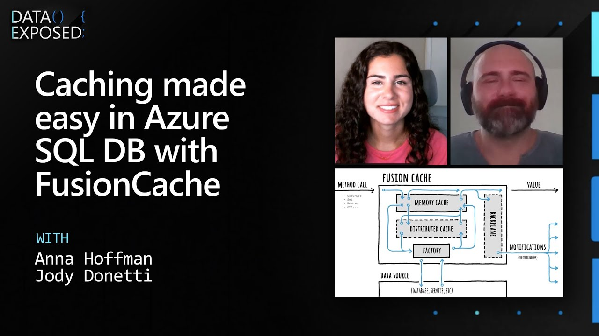
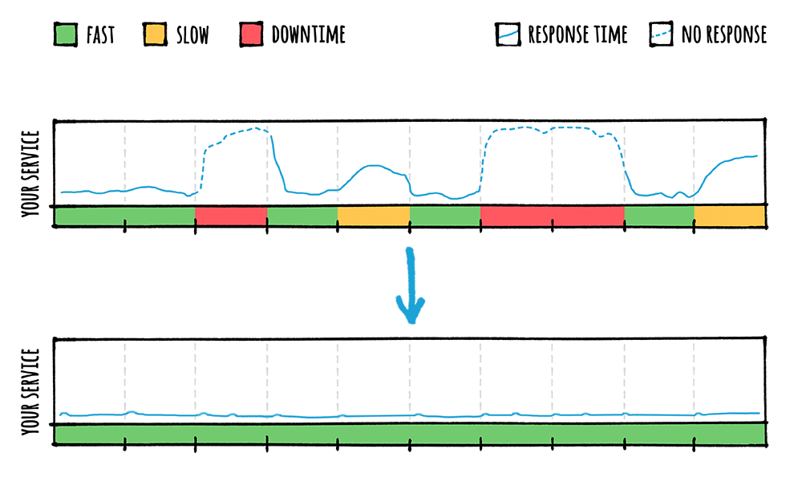

<div align="center">


	
# FusionCache

</div>

<div align="center">

[](https://opensource.org/licenses/MIT)

[](https://twitter.com/intent/tweet?hashtags=fusioncache,caching,cache,dotnet,oss,csharp&text=🚀+FusionCache:+a+new+cache+with+an+optional+2nd+layer+and+some+advanced+features&url=https%3A%2F%2Fgithub.com%2FZiggyCreatures%2FFusionCache&via=jodydonetti)

</div>

| 🙋‍♂️ Updating from before `v0.20.0` ? please [read here](docs/Update_v0_20_0.md). |
|:-------|

### FusionCache is an easy to use, fast and robust cache with advanced resiliency features and an optional distributed 2nd layer.

It was born after years of dealing with all sorts of different types of caches: memory caching, distributed caching, http caching, CDNs, browser cache, offline cache, you name it. So I've tried to put together these experiences and came up with FusionCache.

<div style="text-align:center;">


</div>

It uses a memory cache (any impl of the standard `IMemoryCache` interface) as the **primary** backing store and optionally a distributed, 2nd level cache (any impl of the standard `IDistributedCache` interface) as a **secondary** backing store for better resilience and higher performance, for example in a multi-node scenario or to avoid the typical effects of a cold start (initial empty cache, maybe after a restart).

Optionally, it can also use a **backplane**: in a multi-node scenario this will send notifications to the other nodes to keep all the memory caches involved perfectly synchronized, without any additional work.

FusionCache also includes some advanced resiliency features like **cache stampede** prevention, a **fail-safe** mechanism, fine grained **soft/hard timeouts** with **background factory completion**, customizable **extensive logging** and more (see below).

## 🏆 Award

<div align="center">


</div>

On August 2021, FusionCache received the [Google Open Source Peer Bonus Award](https://twitter.com/jodydonetti/status/1422550932433350666): here is the [official blogpost](https://opensource.googleblog.com/2021/09/announcing-latest-open-source-peer-bonus-winners.html).

## 📕 Getting Started

With [🦄 A Gentle Introduction](docs/AGentleIntroduction.md) you'll get yourself comfortable with the overall concepts.

Want to start using it immediately? There's a [⭐ Quick Start](#-quick-start) for you.

Curious about what you can achieve from start to finish? There's a [👩‍🏫 Step By Step ](docs/StepByStep.md) guide.

More into videos? The great Anna Hoffman has been so nice to listen to me mumble random stuff on [Data Exposed](https://learn.microsoft.com/en-us/shows/data-exposed/caching-made-easy-in-azure-sql-db-with-fusioncache-data-exposed).

<div align="center">

[](https://www.youtube.com/watch?v=V2fCUoJgVAo)

</div>

## ✔ Features
These are the **key features** of FusionCache:

- [**🚀 Cache Stampede prevention**](docs/CacheStampede.md): automatic protection from the Cache Stampede problem
- [**🔀 Optional 2nd level**](docs/CacheLevels.md): an optional 2nd level handled transparently, with any implementation of `IDistributedCache`
- [**💣 Fail-Safe**](docs/FailSafe.md): a mechanism to avoids transient failures, by reusing an expired entry as a temporary fallback
- [**⏱ Soft/Hard timeouts**](docs/Timeouts.md): a slow factory (or distributed cache) will not slow down your application, and no data will be wasted
- [**🧙‍♂️ Adaptive Caching**](docs/AdaptiveCaching.md): for when you don't know upfront the cache duration, as it depends on the value being cached itself
- [**🔂 Conditional Refresh**](docs/ConditionalRefresh.md): like HTTP Conditional Requests, but for caching
- [**🦅 Eager Refresh**](docs/EagerRefresh.md): start a non-blocking background refresh before the expiration occurs
- [**📢 Backplane**](docs/Backplane.md): in a multi-node scenario, it can notify the other nodes about changes in the cache, so all will be in-sync
- [**🔃 Dependency Injection**](docs/DependencyInjection.md): native support for Dependency Injection, with a nice fluent interface including a Builder support
- [**📛 Named Caches**](docs/NamedCaches.md): easily work with multiple named caches, even if differently configured
- [**💫 Natively sync/async**](docs/CoreMethods.md): native support for both the synchronous and asynchronous programming model
- [**📞 Events**](docs/Events.md): a comprehensive set of events, both at a high level and at lower levels (memory/distributed)
- [**🧩 Plugins**](docs/Plugins.md): extend FusionCache with additional behavior like adding support for metrics, statistics, etc...
- [**📜 Logging**](docs/Logging.md): comprehensive, structured and customizable, via the standard `ILogger` interface

<details>
	<summary>Something more 😏 ?</summary>

<br/>

Also, FusionCache has some nice **additional features**:

- **✅ Portable**: targets .NET Standard 2.0, so it can run almost everywhere
- **✅ High Performance**: FusionCache is optimized to minimize CPU usage and memory allocations to get better performance and lower the cost of your infrastructure all while obtaining a more stable, error resilient application
- **✅ Null caching**: explicitly supports caching of `null` values differently than "no value". This creates a less ambiguous usage, and typically leads to better performance because it avoids the classic problem of not being able to differentiate between *"the value was not in the cache, go check the database"* and *"the value was in the cache, and it was `null`"*
- **✅ Circuit-breaker**: it is possible to enable a simple circuit-breaker for when the distributed cache or the backplane become temporarily unavailable. This will prevent those components to be hit with an excessive load of requests (that would probably fail anyway) in a problematic moment, so it can gracefully get back on its feet. More advanced scenarios can be covered using a dedicated solution, like <a href="https://github.com/App-vNext/Polly">Polly</a>
- **✅ Dynamic Jittering**: setting `JitterMaxDuration` will add a small randomized extra duration to a cache entry's normal duration. This is useful to prevent variations of the <a href="https://en.wikipedia.org/wiki/Cache_stampede">Cache Stampede problem</a> in a multi-node scenario
- **✅ Hot Swap**: supports thread-safe changes of the entire distributed cache or backplane implementation (add/swap/removal)
- **✅ Cancellation**: every method supports cancellation via the standard `CancellationToken`, so it is easy to cancel an entire pipeline of operation gracefully
- **✅ Code comments**: every property and method is fully documented in code, with useful informations provided via IntelliSense or similar technologies
- **✅ Fully annotated for [nullability](https://docs.microsoft.com/en-us/dotnet/csharp/nullable-references)**: every usage of nullable references has been annotated for a better flow analysis by the compiler

</details>


## 📦 Packages

Main packages:

| Package Name                   | Version | Downloads |
|--------------------------------|:---------------:|:---------:|
| [ZiggyCreatures.FusionCache](https://www.nuget.org/packages/ZiggyCreatures.FusionCache/) <br/> The core package | [](https://www.nuget.org/packages/ZiggyCreatures.FusionCache/) |  |
| [ZiggyCreatures.FusionCache.Chaos](https://www.nuget.org/packages/ZiggyCreatures.FusionCache.Chaos/) <br/> A package with additional chaos-related utilities and implementations | [](https://www.nuget.org/packages/ZiggyCreatures.FusionCache.Chaos/) |  |

Serializers:

| Package Name                   | Version | Downloads |
|--------------------------------|:---------------:|:---------:|
| [ZiggyCreatures.FusionCache.Serialization.NewtonsoftJson](https://www.nuget.org/packages/ZiggyCreatures.FusionCache.Serialization.NewtonsoftJson/) <br/> A serializer, based on Newtonsoft Json.NET | [](https://www.nuget.org/packages/ZiggyCreatures.FusionCache.Serialization.NewtonsoftJson/) |  |
| [ZiggyCreatures.FusionCache.Serialization.SystemTextJson](https://www.nuget.org/packages/ZiggyCreatures.FusionCache.Serialization.SystemTextJson/) <br/> A serializer, based on the new System.Text.Json | [](https://www.nuget.org/packages/ZiggyCreatures.FusionCache.Serialization.SystemTextJson/) |  |
| [ZiggyCreatures.FusionCache.Serialization.NeueccMessagePack](https://www.nuget.org/packages/ZiggyCreatures.FusionCache.Serialization.NeueccMessagePack/) <br/> A MessagePack serializer, based on the most used [MessagePack](https://github.com/neuecc/MessagePack-CSharp) serializer on .NET | [](https://www.nuget.org/packages/ZiggyCreatures.FusionCache.Serialization.NeueccMessagePack/) |  |
| [ZiggyCreatures.FusionCache.Serialization.ProtoBufNet](https://www.nuget.org/packages/ZiggyCreatures.FusionCache.Serialization.ProtoBufNet/) <br/> A Protobuf serializer, based on one of the most used [protobuf-net](https://github.com/protobuf-net/protobuf-net) serializer on .NET | [](https://www.nuget.org/packages/ZiggyCreatures.FusionCache.Serialization.ProtoBufNet/) |  |
| [ZiggyCreatures.FusionCache.Serialization.CysharpMemoryPack](https://www.nuget.org/packages/ZiggyCreatures.FusionCache.Serialization.CysharpMemoryPack/) <br/> A serializer based on the uber fast new serializer by Neuecc, [MemoryPack](https://github.com/Cysharp/MemoryPack) | [](https://www.nuget.org/packages/ZiggyCreatures.FusionCache.Serialization.CysharpMemoryPack/) |  |
| [ZiggyCreatures.FusionCache.Serialization.ServiceStackJson](https://www.nuget.org/packages/ZiggyCreatures.FusionCache.Serialization.ServiceStackJson/) <br/> A serializer based on the [ServiceStack](https://servicestack.net/) JSON serializer | [](https://www.nuget.org/packages/ZiggyCreatures.FusionCache.Serialization.ServiceStackJson/) |  |

Backplanes:

| Package Name                   | Version | Downloads |
|--------------------------------|:---------------:|:---------:|
| [ZiggyCreatures.FusionCache.Backplane.Memory](https://www.nuget.org/packages/ZiggyCreatures.FusionCache.Backplane.Memory/) <br/> An in-memory backplane (mainly for testing) | [](https://www.nuget.org/packages/ZiggyCreatures.FusionCache.Backplane.Memory/) |  |
| [ZiggyCreatures.FusionCache.Backplane.StackExchangeRedis](https://www.nuget.org/packages/ZiggyCreatures.FusionCache.Backplane.StackExchangeRedis/) <br/> A Redis backplane, based on StackExchange.Redis | [](https://www.nuget.org/packages/ZiggyCreatures.FusionCache.Backplane.StackExchangeRedis/) |  |

Third-party packages:

| Package Name                   | Version | Downloads |
|--------------------------------|:---------------:|:---------:|
| [JoeShook.ZiggyCreatures.FusionCache.Metrics.Core](https://www.nuget.org/packages/JoeShook.ZiggyCreatures.FusionCache.Metrics.Core/)         | [](https://www.nuget.org/packages/JoeShook.ZiggyCreatures.FusionCache.Metrics.Core/) |  |
| [JoeShook.ZiggyCreatures.FusionCache.Metrics.EventCounters](https://www.nuget.org/packages/JoeShook.ZiggyCreatures.FusionCache.Metrics.EventCounters/)         | [](https://www.nuget.org/packages/JoeShook.ZiggyCreatures.FusionCache.Metrics.EventCounters/) |  |
| [JoeShook.ZiggyCreatures.FusionCache.Metrics.AppMetrics](https://www.nuget.org/packages/JoeShook.ZiggyCreatures.FusionCache.Metrics.AppMetrics/)         | [](https://www.nuget.org/packages/JoeShook.ZiggyCreatures.FusionCache.Metrics.AppMetrics/) |  |


## ⭐ Quick Start

FusionCache can be installed via the nuget UI (search for the `ZiggyCreatures.FusionCache` package) or via the nuget package manager console:

```PowerShell
PM> Install-Package ZiggyCreatures.FusionCache
```

As an example, imagine having a method that retrieves a product from your database:

```csharp
Product GetProductFromDb(int id) {
	// YOUR DATABASE CALL HERE
}
```

💡 This is using the **sync** programming model, but it would be equally valid with the newer **async** one for even better performance.

To start using FusionCache the first thing is create a cache instance:

```csharp
var cache = new FusionCache(new FusionCacheOptions());
```

If instead you are using [DI (Dependency Injection)](docs/DependencyInjection.md) use this:

```csharp
services.AddFusionCache();
```

We can also specify some global options, like a default `FusionCacheEntryOptions` object to serve as a default for each call we'll make, with a duration of `2 minutes`:

```csharp
var cache = new FusionCache(new FusionCacheOptions() {
	DefaultEntryOptions = new FusionCacheEntryOptions {
		Duration = TimeSpan.FromMinutes(2)
	}
});
```

Or, using DI, like this:

```csharp
services.AddFusionCache()
	.WithDefaultEntryOptions(new FusionCacheEntryOptions {
		Duration = TimeSpan.FromMinutes(2)
	})
;
```

Now, to get the product from the cache and, if not there, get it from the database in an optimized way and cache it for `30 sec` (overriding the default `2 min` we set above) simply do this:

```csharp
var id = 42;

cache.GetOrSet<Product>(
	$"product:{id}",
	_ => GetProductFromDb(id),
	TimeSpan.FromSeconds(30)
);
```

That's it 🎉

<details>
	<summary>Want a little bit more 😏 ?</summary>

Now, imagine we want to do the same, but also:
- set the **priority** of the cache item to `High` (mainly used in the underlying memory cache)
- enable **fail-safe** for `2 hours`, to allow an expired value to be used again in case of problems with the database ([read more](docs/FailSafe.md))
- set a factory **soft timeout** of `100 ms`, to avoid too slow factories crumbling your application when there's a fallback value readily available ([read more](docs/Timeouts.md))
- set a factory **hard timeout** of `2 sec`, so that, even if there is no fallback value to use, you will not wait undefinitely but instead an exception will be thrown to let you handle it however you want ([read more](docs/Timeouts.md))

To do all of that we simply have to change the last line (reformatted for better readability):

```csharp
cache.GetOrSet<Product>(
	$"product:{id}",
	_ => GetProductFromDb(id),
	// THIS IS WHERE THE MAGIC HAPPENS
	options => options
		.SetDuration(TimeSpan.FromSeconds(30))
		.SetPriority(CacheItemPriority.High)
		.SetFailSafe(true, TimeSpan.FromHours(2))
		.SetFactoryTimeouts(TimeSpan.FromMilliseconds(100), TimeSpan.FromSeconds(2))
);
```

Basically, on top of specifying the *cache key* and the *factory*, instead of specifying just a *duration* as a `TimeSpan` we specify a `FusionCacheEntryOptions` object - which contains all the options needed to control the behavior of FusionCache during each operation - in the form of a lambda that automatically duplicates the default entry options defined before (to copy all our defaults) while giving us a chance to modify it as we like for this specific call.

Now let's say we really like these set of options (*priority*, *fail-safe* and *factory timeouts*) and we want them to be the overall defaults, while keeping the ability to change something on a per-call basis (like the *duration*).

To do that we simply **move** the customization of the entry options where we created the `DefaultEntryOptions`, by changing it to something like this (the same is true for the DI way):

```csharp
var cache = new FusionCache(new FusionCacheOptions() {
	DefaultEntryOptions = new FusionCacheEntryOptions()
		.SetDuration(TimeSpan.FromMinutes(2))
		.SetPriority(CacheItemPriority.High)
		.SetFailSafe(true, TimeSpan.FromHours(2))
		.SetFactoryTimeouts(TimeSpan.FromMilliseconds(100), TimeSpan.FromSeconds(2))
});
```

Now these options will serve as the **cache-wide default**, usable in every method call as a "starting point".

Then, we just change our method call to simply this:

```csharp
var id = 42;

cache.GetOrSet<Product>(
	$"product:{id}",
	_ => GetProductFromDb(id),
	options => options.SetDuration(TimeSpan.FromSeconds(30))
);
```

The `DefaultEntryOptions` we did set before will be duplicated and only the duration will be changed for this call.

</details>

## 📖 Documentation

The documentation is available in the :open_file_folder: [docs](docs/README.md) folder, with:

- [**🦄 A Gentle Introduction**](docs/AGentleIntroduction.md): what you need to know first
- [**🔀 Cache Levels**](docs/CacheLevels.md): a bried description of the 2 available caching levels and how to setup them
- [**📢 Backplane**](docs/Backplane.md): how to get an always synchronized cache, even in a multi-node scenario
- [**🚀 Cache Stampede prevention**](docs/CacheStampede.md): no more overloads during a cold start or after an expiration
- [**💣 Fail-Safe**](docs/FailSafe.md): an explanation of how the fail-safe mechanism works
- [**⏱ Timeouts**](docs/Timeouts.md): the various types of timeouts at your disposal (calling a factory, using the distributed cache, etc)
- [**📛 Named Caches**](docs/NamedCaches.md): how to work with multiple named FusionCache instances
- [**🧙‍♂️ Adaptive Caching**](docs/AdaptiveCaching.md): how to adapt cache duration (and more) based on the object being cached itself
- [**🔂 Conditional Refresh**](ConditionalRefresh.md): how to save resources when the remote data is not changed
- [**🦅 Eager Refresh**](EagerRefresh.md): how to start a background refresh eagerly, before the expiration occurs
- [**🔃 Dependency Injection**](docs/DependencyInjection.md): how to work with FusionCache + DI in .NET
- [**🎚 Options**](docs/Options.md): everything about the available options, both cache-wide and per-call
- [**🕹 Core Methods**](docs/CoreMethods.md): what you need to know about the core methods available
- [**📞 Events**](docs/Events.md): the events hub and how to use it
- [**🧩 Plugins**](docs/Plugins.md): how to create and use plugins
- [**📜 Logging**](docs/Logging.md): logging configuration and usage


## **👩‍🏫 Step By Step**
If you are in for a ride you can read a complete [step by step example](docs/StepByStep.md) of why a cache is useful, why FusionCache could be even more so, how to apply most of the options available and what **results** you can expect to obtain.

<div style="text-align:center;">



</div>


## 🆎 Comparison

There are various alternatives out there with different features, different performance characteristics (cpu/memory) and in general a different set of pros/cons.

A [feature comparison](docs/Comparison.md) between existing .NET caching solutions may help you choose which one to use.

## 🧰 Supported Platforms

FusionCache targets `.NET Standard 2.0` so any compatible .NET implementation is fine: this means `.NET Framework` (the old one), `.NET Core 2+` and `.NET 5/6+` (the new ones), `Mono` 5.4+ and more (see [here](https://docs.microsoft.com/en-us/dotnet/standard/net-standard#net-implementation-support) for a complete rundown).

**NOTE**: if you are running on **.NET Framework 4.6.1** and want to use **.NET Standard** packages Microsoft suggests to upgrade to .NET Framework 4.7.2 or higher (see the [.NET Standard Documentation](https://docs.microsoft.com/en-us/dotnet/standard/net-standard#net-implementation-support)) to avoid some known dependency issues.

## 🖼 Logo

The logo is an [original creation](https://dribbble.com/shots/14854206-FusionCache-logo) and is a [sloth](https://en.wikipedia.org/wiki/Sloth) because, you know, speed.

## 💰 Support

Nothing to do here.

After years of using a lot of open source stuff for free, this is just me trying to give something back to the community.

If you find FusionCache useful please just [**✉ drop me a line**](https://twitter.com/jodydonetti), I would be interested in knowing about your usage.

And if you really want to talk about money, please consider making  **❤ a donation to a good cause** of your choosing, and maybe let me know about that.

## 💼 Is it Production Ready :tm: ?
Yes!

Even though the current version is `0.X` for an excess of caution, FusionCache is already used **in production** on multiple **real world projects** happily handling millions of requests per day, or at least these are the projects I'm aware of.

Considering that the FusionCache packages have been downloaded more than **a million times** (thanks everybody!) it may very well be used even more.

And again, if you are using it please [**✉ drop me a line**](https://twitter.com/jodydonetti), I'd like to know!
