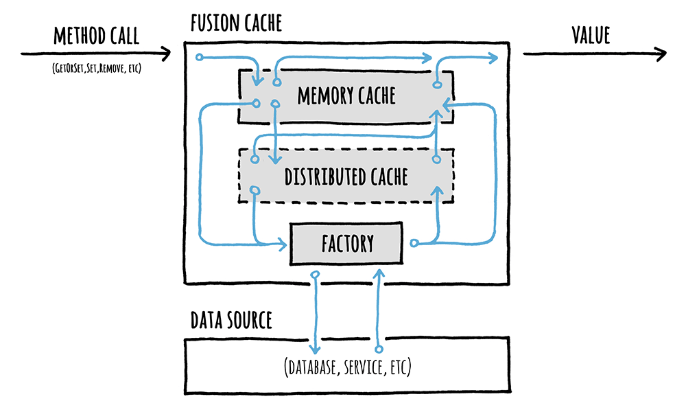
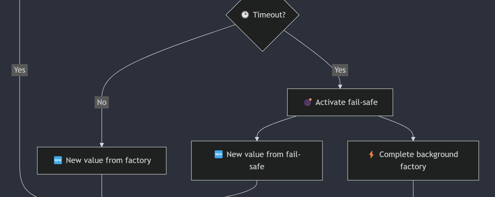

<div align="center">


</div>


# 🦄 A Gentle Introduction

FusionCache is an easy to use, fast and robust hybrid cache with advanced resiliency features.

Being a hybrid cache means that it can work both as a normal memory cache (L1) or, optionally, as a multi-level cache (L1+L2) where the 2nd level can be any implementation of the standard `IDistributedCache` interface. This will get us better scalability, better performance and more resiliency in a multi-node scenario or even just to ease cold starts (initial empty cache, maybe after a restart).

Optionally, it can also use a **backplane**: in a multi-node scenario this will send notifications to the other nodes to keep each node's memory cache perfectly synchronized, without any additional work.

FusionCache also includes some advanced resiliency features like a [fail-safe](FailSafe.md) mechanism, [cache stampede](CacheStampede.md) prevention, fine grained [soft/hard timeouts](Timeouts.md) with background factory completion, [eager refresh](EagerRefresh.md), full observability via [logging](Logging.md) and [OpenTelemetry](OpenTelemetry.md) and more (see below).


<div style="text-align:center;">



</div>


## 🏠 Feels Like Home

FusionCache tries to feel like a native part of .NET by adhering to the naming conventions of the standard **memory** and **distributed** cache components:

|                         | MemoryCache               | DistributedCache               | FusionCache               |
| ---:                    | :---:                     | :---:                          | :---:                     |
| **Interface**           | `IMemoryCache`            | `IDistributedCache`            | `IFusionCache`            |
| **Implementation**      | `MemoryCache`             | `[Various]Cache`               | `FusionCache`             |
| **Options**             | `MemoryCacheOptions`      | `[Various]CacheOptions`        | `FusionCacheOptions`      |
| **Entry Options**       | `MemoryCacheEntryOptions` | `DistributedCacheEntryOptions` | `FusionCacheEntryOptions` |

If we have ever used one of those, we'll feel at home with FusionCache.


## 🚀 Factory ([more](CacheStampede.md))

A factory is just a function that we specify when using the main `GetOrSet[Async]` method: basically it's the way we specify **how to get a value** when it's needed.

Here's an example:

```csharp
var id = 42;

var product = cache.GetOrSet<Product>(
    $"product:{id}",
    _ => GetProductFromDb(id), // THIS IS THE FACTORY
    options => options.SetDuration(TimeSpan.FromMinutes(1))
);
```

FusionCache will search for the value in the cache (*memory* and *distributed*, if available) and, if nothing is there, will call the factory to obtain the value: it then saves it into the cache with the specified options, and returns it to the caller, all transparently.

Special care has been put into ensuring that **only 1** factory per-key will be executed concurrently, to avoid what is known as [Cache Stampede](https://en.wikipedia.org/wiki/Cache_stampede).

Read more [**here**](CacheStampede.md), or enjoy the complete [**step by step**](StepByStep.md) guide.


## 🔀 Cache Levels ([more](CacheLevels.md))

There are 2 caching levels, transparently handled by FusionCache for us.

These are:
- **1️⃣ Primary**: it's a memory cache, is always there and is used to have a very fast access to data in memory, with high data locality. We can give FusionCache any implementation of `IMemoryCache` or let FusionCache create one for us
- **2️⃣ Secondary**: is an *optional* distributed cache (any implementation of `IDistributedCache` will work) and, since it's not strictly necessary and it serves the purpose of **easing a cold start** or **coordinating with other nodes**, it is treated differently than the primary one. This means that any potential error happening on this level (remember the [fallacies of distributed computing](https://en.wikipedia.org/wiki/Fallacies_of_distributed_computing) ?) can be automatically handled by FusionCache to not impact the overall application, all while (optionally) logging any detail of it for further investigation

Everything is handled transparently for us.

Read more [**here**](CacheLevels.md), or enjoy the complete [**step by step**](StepByStep.md) guide.


## 📢 Backplane ([more](Backplane.md))

If we are in a scenario with multiple nodes, each with their own local memory cache, we typically also use a distributed cache as a secondary level (see above).

Even using that, we may find that each memory cache may not be necessarily in-sync with the others, because when a value is cached locally it will stay the same until the `Duration` passes and expiration occurs.

To avoid this and have everything always synchronized we can use a backplane, a shared message bus where change notifications will be automatically sent to all other connected nodes each time a value changes in the cache, without us having to do anything.

Read more [**here**](Backplane.md), or enjoy the complete [**step by step**](StepByStep.md) guide.


## 💣 Fail-Safe ([more](FailSafe.md))

Sometimes things can go wrong, and calling a factory for an expired cache entry can lead to exceptions because the database or the network is temporarily down: normally in this case the exception will cause an error page in our website, a failure status code in our api or something like that.

By enabling the fail-safe mechanism we can simply tell FusionCache to ignore those errors and **temporarily use the expired cache entry**: our website or service will remain online, and our users would not notice anything.

Read more [**here**](FailSafe.md), or enjoy the complete [**step by step**](StepByStep.md) guide.


## ⏱️ Timeouts ([more](Timeouts.md))

Sometimes our data source (database, webservice, etc) is overloaded, the network is congested or something else is happening, and the end result is a **long wait** for a fresh piece of data.

Wouldn't it be nice if there could be a way to simply let FusionCache temporarily reuse an expired cache entry if the factory is taking too long?

Enter **soft/hard timeouts**.

Read more [**here**](Timeouts.md), or enjoy the complete [**step by step**](StepByStep.md) guide.


## ↩️ Auto-Recovery([more](AutoRecovery.md))

As we know from the [Fallacies Of Distributed Computing](https://en.wikipedia.org/wiki/Fallacies_of_distributed_computing), something may go wrong while we are using distributed components like the distributed cache or the backplane, even if only in a transient way.

Without some extra care what can happen is that data would not be saved in the distributed cache or other nodes may not be notified of changes: this would result in out-of-sync issues.

wouldn't it be nice if FusionCache would help us is some way when transient error happens?

Enter **Auto-Recovery**: everything is done automatically, and it just works.

Read more [**here**](AutoRecovery.md).


## 🏷️ Tagging ([more](Tagging.md))

Tagging is an incredibly powerful feature: cache entries can be tagged with one or more tags, and later they can be evicted all at once by just calling `RemoveByTag("my-tag")`.

The overall [design](https://github.com/ZiggyCreatures/FusionCache/issues/319) used to achieve this is such that, even when working against a massive cache with millions of entries, will not incur in any upfront cost (yes, even a distributed L2 like a Redis gigantic instance).

Tagging works in any supported scenario: with or without an optional L2 (distributed level), an optional backplane, shared caches, cache key prefix, fail-safe, soft/hard timeouts, auto-recovery and everything else.

Read more [**here**](Tagging.md).


## 🧼 Clear ([more](Clear.md))

Thanks to the design used for the Tagging feature (see above), FusionCache also supports a proper `Clear()` mechanism for the entire cache.

Yes, yes: the abiltiy to clear seems like an easy one but when we consider things like shared caches, cache key prefix and all the other features... it's definitely not an easy feat. But yeah, it just works.

Read more [**here**](Clear.md).


## 🔃 Dependency Injection + Builder ([more](DependencyInjection.md))

FusionCache fully supports [Dependency Injection (DI)](https://docs.microsoft.com/en-us/dotnet/core/extensions/dependency-injection), a design pattern to achieve a form of Inversion of Control (IoC) in our code.

It also supports the modern and easy to use Builder approach.

Read more [**here**](DependencyInjection.md), or enjoy the complete [**step by step**](StepByStep.md) guide.


## 📛 Named Caches ([more](NamedCaches.md))

Just like with the standard [named http clients](https://learn.microsoft.com/en-us/aspnet/core/fundamentals/http-requests?view=aspnetcore-7.0#named-clients) in .NET, with FusionCache it's possible to have multiple named caches.

Thanks to the native [builder](DependencyInjection.md) support, it's very easy to configure different caches identified by different names.

Read more [**here**](NamedCaches.md).


## Ⓜ️ Support for Microsoft HybridCache ([more](MicrosoftHybridCache.md))

With .NET 9, Microsoft released their new [HybridCache](https://learn.microsoft.com/en-us/aspnet/core/performance/caching/hybrid?view=aspnetcore-9.0).

This may turn the HybridCache abstract class into some sort of "lingua franca" for a basic set of common features for all hybrid caches in .NET.

So FusionCache is available ALSO as an implementation of HybridCache, via an adapter class.

> [!IMPORTANT]
> FusionCache is the FIRST 3rd party implementation of HybridCache from Microsoft. But not just that: in a strange turn of events, since at the time of this writing (Jan 2025) Microsoft has not yet released their default implementation, FusionCache is the FIRST production-ready implementation of HybridCache AT ALL, including the one by Microsoft itself. Quite bonkers 🤯

Read more [**here**](MicrosoftHybridCache.md).


## 🧬 Diagrams

Sometimes it's nice to be able to visualize the internal flow of a system, even more so for such a complex beast as an hybrid cache like FusionCache.

So, diagrams!

<div align="center">

[](Diagrams.md)

</div>

Read more [**here**](Diagrams.md).


## 🎚️ Options ([more](Options.md))

There are 2 kinds of options:
 
 - `FusionCacheOptions`: cache-wide options, related to the entire FusionCache instance
 - `FusionCacheEntryOptions`: per-entry options, related to each method call/entry

It's also possible to define `DefaultEntryOptions`: they can act as default options (like a "starting point") for every entry/method call, which can then be furtherly customized in-place.

Read more [**here**](Options.md), or enjoy the complete [**step by step**](StepByStep.md) guide.


## 🕹️ Core Methods ([more](CoreMethods.md))

At a high level there are 6 core methods:

- `Set[Async]`
- `GetOrSet[Async]`
- `GetOrDefault[Async]`
- `TryGet[Async]`
- `Expire[Async]`
- `Remove[Async]`

Then there are methods for Tagging and Clear:
- `RemoveByTag[Async]`
- `Clear[Async]`

All of them work **on both the memory cache and the distributed cache** (if any) in a transparent way: we don't have to do anything extra for it to coordinate the 2 levels.

All of them are available in both a **sync** and an **async** version.

Finally, most of them have a set of **overloads** for a better ease of use.

Read more [**here**](CoreMethods.md).


## 💫 Natively Sync + Async

Everything is natively available for both the **sync** and **async** programming models.

Any operation works seamlessly with any other, even if one is **sync** and the other is **async**: an example is multiple concurrent factory calls for the same cache key, some of them **sync** while others **async**, all coordinated together at the same time with no problems and a guarantee that only one will be executed at the same time.


## 📞 Events ([more](Events.md))

There's a comprehensive set of events to subscribe to regarding core events inside of a FusionCache instance, both at a high level and at lower levels (memory/distributed levels).

Read more [**here**](Events.md).


## 🧩 Plugins ([more](Plugins.md))

FusionCache supports extensibility via plugins: it is possible for example to listen to [events](Events.md) and react in any way we want.

In time, the most useful plugins will be listed directly in the homepage.

Read more [**here**](Plugins.md).


## 🔭 OpenTelemetry ([more](OpenTelemetry.md))

Full observability support, thanks to [OpenTelemetry](https://opentelemetry.io/) integration, means that we can have a clear and detailed view of what happens in our production systems.

Detailed traces are available, with timings, durations, details, events and tags.

We can also observe one of the various metrics available like cache hit/miss, method calls and so on.


## 📜 Logging ([more](Logging.md))

FusionCache can log extensively to help us pinpoint any possible problem in our production environment.

It uses the standard `ILogger<T>` interface and a structured logging approach so it fits well in the .NET ecosystem, allowing us to use any implementation we want that is compatible with it (Serilog, NLog, etc): it also has a series of settings we may find useful to better tune its behavior.

Read more [**here**](Logging.md).
