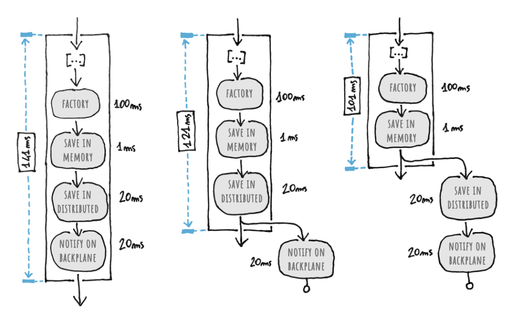

# 🚀 Background Distributed Operations

| ⚡ TL;DR (quick version) |
| -------- |
| FusionCache can execute most distributed operations in the background, to avoid having to wait for them to finish, and thanks to Auto-Recovery, any transient error will be automatically managed for us. |

When we scale horizontally we go multi-node, and when we go multi-node we have to introduce distributed components, and when we talk about distributed components we are talking about the **distributed cache** and the **backplane**.

These components can help us scale our infrastructure horizontally, by distributing the load on multiple nodes instead of scaling vertically by buying more powerful servers.

## 🐌 Do More, Wait More

This is all good, but as we know from the [Fallacies Of Distributed Computing](https://en.wikipedia.org/wiki/Fallacies_of_distributed_computing) there are also potential drawbacks like bandwidth is not infinite, the network is not always reliable and so on. Even when all is normally good, there's still the fact that latency is not zero and in general any operation has a cost, not just in memory allocated but in time spent and this, in turn, means that our method calls end up being **slower**.

Now, of course the extra time spent on the distributed cache and backplane operations is spent well since it allows multiple nodes to work all together in harmony and obtain a synchronized cache as a whole.

Wouldn't it be nice if, as they say, we could _"have our cake and eat it too"_?

It turns out that yes, yes we can!

## ⚡ Do More, Wait Less!

It's possible to enable background execution of _most_ distributed operations, meaning distributed cache operations and backplane operations, with 2 simple options:
- `AllowBackgroundDistributedCacheOperations`
- `AllowBackgroundBackplaneOperations`

As the name implies, these two options allow the execution of _most_ distributed cache and backplane operations to be in the background.

This means that our `GetOrSet()` calls can end sooner and take less time, making our apps and services even faster.

Since they are _entry options_, we can set them granularly per-call or, if we want, set them in the `DefaultEntryOptions` so that they will be applied by default to any call (and, as always, we can override them in some method calls if we need to).

Pretty easy, huh 😏 ?

Finally, we should also keep in mind that the distributed operations are basically a 2-step process: FusionCache updates the distributed cache and, only when that succeeded, it can notify other nodes via the backplane. This is because if it would notify the other nodes of an updated value before such value has been saved into the distributed cache, the other nodes would read the old one, making the entire workflow useless.

> [!NOTE]  
> Since backplane notifications make sense only **after** the distributed cache has been updated, it does not make any sense to set `AllowBackgroundDistributedCacheOperations` to `true` and `AllowBackgroundBackplaneOperations` to `false`. We can't avoid waiting the first step but wait the step after that, right?

## 👩‍💻 Examples

Now, to have an idea of what this means let's look at the following 3 examples:

For all 3 examples let's suppose `100 ms` to execute the factory, `1 ms` to save the result in the memory cache, `20 ms` to save the result in the distributed cache and another `20 ms` to notify the other nodes via the backplane (all numbers are, of course, simple and nicely rounded examples).

### Example 1 (left)

This is what happens with both options set to `false`: FusionCache will wait for both the distributed cache operation and the backplane operation to finish before returning.

Execution time: `141 ms`.

### Example 2 (center)

This is what happens when `AllowBackgroundBackplaneOperations` is se to `true` but `AllowBackgroundDistributedCacheOperations` is set to `false`: FusionCache will wait for the distributed cache operation but, after that, it will not wait for the backplane operation.

Execution time: `121 ms`.

### Example 3 (right)

This is what happens when both options are set to `true`: FusionCache will save the result to the memory cache but, after that, will immediately return and will delegate the distributed operations to be in the background.

Execution time: `101 ms`.

## 🤔 Transient Problems

But wait, hold on: what happens if there's a transient issue while updating the distributed cache or while sending a notification on the backplane? Shouldn't they be handled in some way?

Yes, in fact they should, but not by us, and not manually!

With FusionCache we can count on [Auto-Recovery](AutoRecovery.md) to take care of all these issues, so that we can get the best of both worlds: faster execution + automatic handling of transient errors, without having to do anything more than just calling our trusted `GetOrSet()` or `Set()` or `Remove()` calls (any method is supported of course).

That's all 🥳

## 👍 Reasonable Defaults

Currently the defaults are:
- `AllowBackgroundDistributedCacheOperations`: `false`
- `AllowBackgroundBackplaneOperations`: `true`

Why is that?

The idea is that frequently in a multi-node scenario multiple sequential calls from the same user may go through different nodes, and frequently not all nodes have the same cached value locally (in the memroy cache, L1): this means that if we wait at least the distributed cache operation after an update, even if the next call would go through a different node where the value is not cached, it will be automatically taken from the distributed cache, with the new value. Backplane operations are also usually way faster than a distributed cache save, and this means that it's very unlikely that the system can observe an unsynchronized state.

In general, these defaults strike a good balance overall, all things considered.

Having said that, if we want an even stricter insurance about full blown synchronization of the global cached state, we can set them both to `false`. If, on the other hand, we can accept the opposite, we can set them both to `true`.

Personally I set them both to `true` a lot of times, but that wholly depends on the specifics of the scenario we are working it and its constraints.