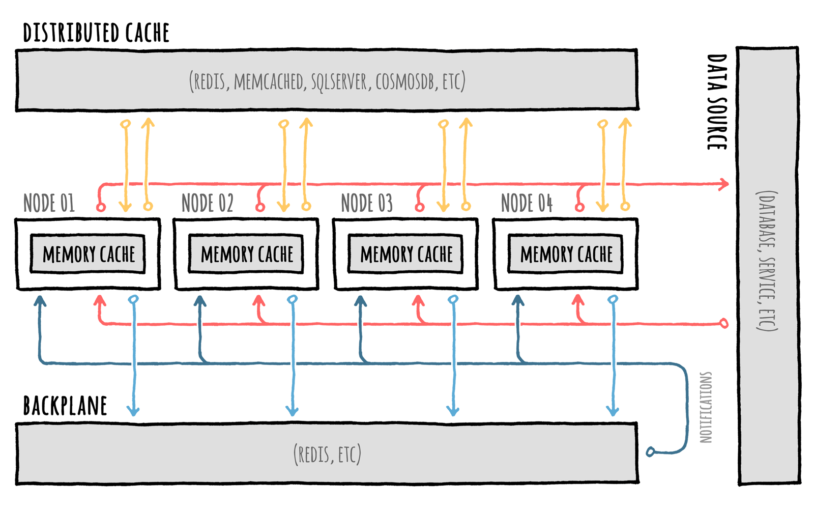

<div align="center">


</div>


# 📢 Backplane

If we are in a scenario with multiple nodes, each with their own local memory cache, we typically also use a distributed cache as a secondary layer (see [here](CacheLevels.md)).

But even when using that, we may find that each memory cache on each node may not be in-sync with the others, because when a value is cached locally it will stay the same until the `Duration` passes and expiration occurs.

Luckily, there's an easy solution to this synchronization problem: use a **backplane**.

<div align="center">



</div>

A backplane is like a message bus where change notifications will be published to all other connected nodes each time something happens to a cache entry, all automatically without us having to do anything.

By default, everything is handled transparently for us 🎉

## How it works

As an example, let's look at the flow of a `GetOrSet` operation with 3 nodes (`N1`, `N2`, `N3`):

- `GetOrSet` is called on `N1`
- no data is found in the memory on `N1` or in the distributed cache (or it is expired): call to the database to grab fresh data
- fresh data saved in memory cache on `N1` + distributed cache
- a backplane notification is sent to notify the other nodes
- the notification is received on `N2` and `N3` and they evict the entry from their own respective memory cache
- as soon as a new request for the same cache entry arrives on `N2` or `N3`, the new version is taken from the distributed cache and saved locally on their memory cache
- `N1`, `N2`, `N3` live happily synchronized ever after

As we can see we didn't have to do anything more than usual: everything else is done automatically for us.


## Packages

Currently there are 2 official packages we can use:

| Package Name                   | Version | Downloads |
|--------------------------------|:---------------:|:---------:|
| [ZiggyCreatures.FusionCache.Backplane.Memory](https://www.nuget.org/packages/ZiggyCreatures.FusionCache.Backplane.Memory/) <br/> A simple in-memory implementation (typically used only for testing) | [](https://www.nuget.org/packages/ZiggyCreatures.FusionCache.Backplane.Memory/) |  |
| [ZiggyCreatures.FusionCache.Backplane.StackExchangeRedis](https://www.nuget.org/packages/ZiggyCreatures.FusionCache.Backplane.StackExchangeRedis/) <br/> A [Redis](https://redis.io/) implementation based on the awesome [StackExchange.Redis](https://github.com/StackExchange/StackExchange.Redis) library | [](https://www.nuget.org/packages/ZiggyCreatures.FusionCache.Backplane.StackExchangeRedis/) |  |

If we are already using a Redis instance as a distributed cache, we just have to point the backplane to the same instance and we'll be good to go (but if we share the same Redis instance with multiple caches, please read [some notes](RedisNotes.md)).


## Example

As an example, we'll use FusionCache with [Redis](https://redis.io/), as both a **distributed cache** and a **backplane**.

To start, just install the Nuget packages:

```PowerShell
# CORE PACKAGE
PM> Install-Package ZiggyCreatures.FusionCache

# SERIALIZER
PM> Install-Package ZiggyCreatures.FusionCache.Serialization.NewtonsoftJson

# DISTRIBUTED CACHE
PM> Install-Package Microsoft.Extensions.Caching.StackExchangeRedis

# BACKPLANE
PM> Install-Package ZiggyCreatures.FusionCache.Backplane.StackExchangeRedis
```

Then, to create and setup the cache manually, do this:

```csharp
// INSTANTIATE FUSION CACHE
var cache = new FusionCache(new FusionCacheOptions());

// INSTANTIATE A REDIS DISTRIBUTED CACHE (IDistributedCache)
var redis = new RedisCache(new RedisCacheOptions() {
    Configuration = "OUR CONNECTION STRING HERE"
});

// INSTANTIATE THE FUSION CACHE SERIALIZER
var serializer = new FusionCacheNewtonsoftJsonSerializer();

// SETUP THE DISTRIBUTED 2ND LAYER
cache.SetupDistributedCache(redis, serializer);

// CREATE THE BACKPLANE
var backplane = new RedisBackplane(new RedisBackplaneOptions() {
    Configuration = "OUR CONNECTION STRING HERE"
});

// SETUP THE BACKPLANE
cache.SetupBackplane(backplane);
```

If instead we prefer a **DI (Dependency Injection)** approach we can do this:

```csharp
// REGISTER REDIS AS A DISTRIBUTED CACHE
services.AddStackExchangeRedisCache(options => {
    options.Configuration = "OUR CONNECTION STRING HERE";
});

// REGISTER THE FUSION CACHE SERIALIZER
services.AddFusionCacheNewtonsoftJsonSerializer();

// REGISTER THE FUSION CACHE BACKPLANE
services.AddFusionCacheStackExchangeRedisBackplane(options => {
    options.Configuration = "OUR CONNECTION STRING HERE";
});

// REGISTER FUSION CACHE
services.AddFusionCache();
```

and FusionCache will automatically discover the **distributed cache** and the **backplane** and immediately starts using them.

The most common scenario is probably to use both a distributed cache and a backplane, working together: the former used as a shared state that all nodes can use, and the latter used to notify all the nodes about synchronization events so that every node is perfectly updated.

But is it really necessary to use a distributed cache at all?

Let's find out.


## 🤔 Distributed cache: is it really necessary?

The idea seems like a nice one: in a multi-node scenario we may want to use only memory caches on each node + the backplane for cache synchronization, without having to use a shared distributed cache.

But remember: when using a backplane, FusionCache automatically publish notifications everytime something "changes" in the cache, namely when we directly call `Set` or `Remove` (of course) but also when calling `GetOrSet` AND the factory actually go to the database (or whatever) to get the fresh piece of data.

So, without the distributed cache as a shared state, every notification would end up requiring a new call to the database, again and again, every single time a new request comes in.

Why? Let's look at an example flow of a `GetOrSet` operation with 3 nodes (`N1`, `N2`, `N3`), without a distributed cache:

- `GetOrSet` is called on `N1`
- no data is found in the memory on `N1` (or it is expired): call to the database to grab fresh data
- fresh data saved in memory cache on `N1`
- a backplane notification is sent to notify the other nodes
- the notification is received on `N2` and `N3` and they evict the entry from their own respective memory cache
- a new request for the same cache entry arrives on `N2` or `N3`
- no data is found in the memory on `N2`: call to the database to grab fresh data
- fresh data saved in memory cache on `N2`
- a backplane notification is sent to notify the other nodes
- the notification is received on `N1` and `N3` and they evict the entry from their own respective memory cache
- so `N1` just erased the entry in the memory cache

As we can see this would basically make the entire cache useless.

This is because not having a shared state means we don't know when something actually changed, since when we get fresh data from the database it may be changed since the last time, so we need to notify the other nodes, etc going into an infinite loop.

So how can we solve this?


## 🙋‍♂️ Look ma: no distributed cache!

The solution is to **disable automatic backplane notifications** and publish them only when we want to signal an actual change.

And how can we do this, in practice?

To decide if notifications should be published on the backplane FusionCache looks at the `EnableBackplaneNotifications` option on the `FusionCacheEntryOptions` object: this means that we can be granular and specify it for every single operation, but as we know this also means that we can set it to `false` in the global `DefaultEntryOptions` once, and not having to disable it every time.

But then, when we **want** to publish a notification, how can we do it? Easy peasy, simply enable it only for that specific operation.

Let's look at a concrete example.


## Example

```csharp
// INITIAL SETUP: DISABLE AUTOMATIC NOTIFICATIONS
cache.DefaultEntryOptions.EnableBackplaneNotifications = false;

// [...]

// LATER ON, SUPPOSE WE JUST SAVED THE PRODUCT IN THE DATABASE, SO WE NEED TO UPDATE THE CACHE
cache.Set(
    $"product:{product.Id}",
    product,
    options => options.SetDuration(TimeSpan.FromMinutes(5)).SetBackplane(true)
);

// LATER ON, SUPPOSE WE JUST REMOVED THE PRODUCT FROM THE DATABASE, SO WE NEED TO REMOVE IT FROM THE CACHE TOO
cache.Remove(
    $"product:{product.Id}",
    options => options.SetBackplane(true)
);
```


## Conclusion

As we saw there are basically 2 ways of using a backplane:

- **1️⃣ MEMORY + DISTRIBUTED + BACKPLANE**: probably the most common, where we don't have to do anything and everything just works
- **2️⃣ MEMORY + BACKPLANE**: probably the less common, where we have to disable automatic notifications in the default entry options, and then we have to manually enable them on a call-by-call basis only when we actually want to notify the other nodes

So remember: without a distributed cache we should **⚠ DISABLE** backplane notifications by default, otherwise your system may suffer.
