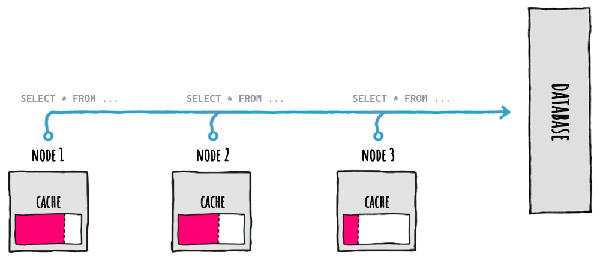

<div align="center">


</div>

# 🔀 Cache Levels: Primary and Secondary

| ⚡ TL;DR (quick version) |
| -------- |
| To ease cold starts and/or help with horizontal scalability (multiple nodes with their own local memory cache) it's possible to setup a 2nd level, known as L2. At setup time, simply pass any implementation of `IDistributedCache` and a serializer: the existing code does not need to change, it all just works. |

When our apps restarts and we are using only the 1st level (memory), the cache will need to be repopulated from scratch since the cached values are stored only in the memory space of the apps themselves.

This problem is known as **cold start** and it can generate a lot of requests to our database.

<div align="center">


</div>

When our services need to handle more and more requests we can scale vertically, meaning we can make our servers bigger. This approach though can only go so far, and after a while what we need is to scale horizontally, meaning we'll add more nodes to split the traffic among.

<div align="center">



</div>

But, when scaling horizontally and using only  the 1st level (memory), each memory cache in each node needs to be populated indipendently, by asking the same data to the database, again generating more requests to the database.

As we can see both of these issues will generate more database pressure: this is something we need to handle accordingly.

Luckily, FusionCache can help us.


## 🔀 2nd Level

FusionCache allows us to have 2 caching levels, transparently handled by FusionCache for us:

- **1️⃣ L1 (memory)**: it's a memory cache and is used to have a very fast access to data in memory, with high data locality. You can give FusionCache any implementation of `IMemoryCache` or let FusionCache create one for you
- **2️⃣ L2 (distributed)**: is an *optional* distributed cache and it serves the purpose of **easing a cold start** or **sharing data with other nodes**

Everything required to have the 2 levels communicate between them is handled transparently for us.

Since L2 is distributed, and we know from the [fallacies of distributed computing](https://en.wikipedia.org/wiki/Fallacies_of_distributed_computing) that stuff can go bad, all the issues that may happend there can be automatically handled by FusionCache to not impact the overall application, all while (optionally) tracking any detail of it for further investigation (via [Logging](Logging.md) and [OpenTelemetry](OpenTelemetry.md)).

Any implementation of the standard `IDistributedCache` interface will work (see below for a list of the available ones), so we can pick Redis, Memcached or any technology we like.

Because a distributed cache talks in binary data (meaning `byte[]`) we also need to specify a *serializer*: since .NET does not have a generic interface representing a binary serializer, FusionCache defined one named `IFusionCacheSerializer`. We simply provide an implementation of that by picking one of the existing ones, which natively support formats like Json, Protobuf, MessagePack and more (see below) or create our own.

In the end this boils down to 2 possible ways:

- **MEMORY ONLY (L1):** FusionCache will act as a normal memory cache
- **MEMORY + DISTRIBUTED (L1+L2):** if we also setup an L2, FusionCache will automatically coordinate the 2 levels, while gracefully handling all edge cases to get a smooth experience

Of course in both cases you will also have at your disposal the added ability to enable extra features, like [fail-safe](FailSafe.md), advanced [timeouts](Timeouts.md) and so on.

Also, if needed, we can use a different `Duration` specific for the distributed cache via the `DistributedCacheDuration` option: in this way updates to the distributed cache can be picked up more frequently, in case we don't want to use a [backplane](Backplane.md) for some reason.

Finally we can even execute the distributed operations in the background, to make things even faster: we can read more on the related [docs page](BackgroundDistributedOperations.md).


## 📢 Backplane

When using multiple nodes for horizontal scalability we can use an L2 as a shared cache for all the nodes to use.

But each L1 cache in each node may become out of sync with the other nodes after a change on a specific node: to solve this, it is suggested to also use a backplane.

All the existing code will remain the same, it's just a 1 line change at setup time.

Read [here](Backplane.md) for more.


## 🧬 Diagrams

Good, good, so FusionCache takes care of coordinating everything between L1, L2 and maybe the backplane, if enabled.

But... it can still be complex to grasp all of that at once, right? Wouldn't it be nice to be able to _visualize_ what we just said? Yes, it would so: diagrams!

<div align="center">

[](Diagrams.md)

</div>

Read [here](Diagrams.md) for more.


## 🗃 Wire Format Versioning

When working with the memory cache, everything is easier: at every run of our apps or services everything starts clean, from scratch, so even if there's a change in the structure of the cache entries used by FusionCache there's no problem.

The distributed cache, instead, is a different beast: when saving a cache entry in there, that data is shared between different instances of the same applications, between different applications altogether and maybe even with different applications that are using a different version of FusionCache.

So when the structure of the cache entries need to change to evolve FusionCache, how can this be managed?

Easy, by using an additional cache key modifier for the distributed cache, so that if and when the version of the cache entry structure changes, there will be no issues serializing or deserializing different versions of the saved data.

In practice this means that, when saving something for the cache key `"foo"`, in reality in the distributed cache it will be saved with the cache key `"v0:foo"`.

This has been planned from the beginning, and is the way to manage changes in the wire format used in the distributed cache between updates: it has been designed in this way specifically to support FusionCache to be updated safely and transparently, without interruptions or problems.

So what happens when there are 2 versions of FusionCache running on the same distributed cache instance, for example when two different apps share the same distributed cache and one is updated and the other is not?

Since the old version will write to the distributed cache with a different cache key than the new version, this will not create conflicts during the update, and it means that we don't need to stop all the apps and services that works on it and wipe all the distributed cache data just to do the upgrade.

At the same time though, if we have different apps and services that use the same distributed cache shared between them, we need to understand that by updating only one app or service and not the others will mean that the ones updated will read/write using the new distributed cache keys, while the non updated ones will keep read/write using the old distributed cache keys.

Again, nothing catastrophic, but something to consider.

## 💾 Disk Cache

In certain situations we may like to have some of the benefits of a 2nd level like better cold starts (when the memory cache is initially empty) but at the same time we don't want to have a separate **actual** distributed cache to handle, or we simply cannot have it: a good example may be a mobile app, where everything should be self contained.

In those situations we may want a distributed cache that is "not really distributed", something like an implementation of `IDistributedCache` that reads and writes directly to one or more local files.

Is this possible?

Yes, totally, and there's a [dedicated page](DiskCache.md) to learn more.

## ↩️ Auto-Recovery

Since the distributed cache is a distributed component (just like the backplane), most of the transient errors that may occur on it are also covered by the Auto-Recovery feature.

We can read more on the related [docs page](AutoRecovery.md).

## 📦 Packages

There are a variety of already existing `IDistributedCache` implementations available, just pick one:

| Package Name                   | License | Version |
|--------------------------------|:---------------:|:---------------:|
| [Microsoft.Extensions.Caching.StackExchangeRedis](https://www.nuget.org/packages/Microsoft.Extensions.Caching.StackExchangeRedis/) <br/> The official Microsoft implementation for Redis | `MIT` | [](https://www.nuget.org/packages/Microsoft.Extensions.Caching.StackExchangeRedis/) |
| [Microsoft.Extensions.Caching.SqlServer](https://www.nuget.org/packages/Microsoft.Extensions.Caching.SqlServer/) <br/> The official Microsoft implementation for SqlServer | `MIT` | [](https://www.nuget.org/packages/Microsoft.Extensions.Caching.SqlServer/) |
| [Microsoft.Extensions.Caching.Cosmos](https://www.nuget.org/packages/Microsoft.Extensions.Caching.Cosmos/) <br/> The official Microsoft implementation for Cosmos DB | `MIT` | [](https://www.nuget.org/packages/Microsoft.Extensions.Caching.Cosmos/) |
| [MongoDbCache](https://www.nuget.org/packages/MongoDbCache/) <br/> An implementation for MongoDB | `MIT` | [](https://www.nuget.org/packages/MongoDbCache/) |
| [Community.Microsoft.Extensions.Caching.PostgreSql](https://www.nuget.org/packages/Community.Microsoft.Extensions.Caching.PostgreSql/) <br/> An implementation for PostgreSQL | `MIT` | [](https://www.nuget.org/packages/Community.Microsoft.Extensions.Caching.PostgreSql/) |
| [MarkCBB.Extensions.Caching.MongoDB](https://www.nuget.org/packages/MarkCBB.Extensions.Caching.MongoDB/) <br/> Another implementation for MongoDB | `Apache v2` | [](https://www.nuget.org/packages/MarkCBB.Extensions.Caching.MongoDB/) |
| [EnyimMemcachedCore](https://www.nuget.org/packages/EnyimMemcachedCore/) <br/> An implementation for Memcached | `Apache v2` | [](https://www.nuget.org/packages/EnyimMemcachedCore/) |
| [NeoSmart.Caching.Sqlite](https://www.nuget.org/packages/NeoSmart.Caching.Sqlite/) <br/> An implementation for SQLite | `MIT` | [](https://www.nuget.org/packages/NeoSmart.Caching.Sqlite/) |
| [AWS.AspNetCore.DistributedCacheProvider](https://www.nuget.org/packages/AWS.AspNetCore.DistributedCacheProvider/) <br/> An implementation for AWS DynamoDB | `Apache v2` | [](https://www.nuget.org/packages/AWS.AspNetCore.DistributedCacheProvider/) |
| [Aerospike.Extensions.Caching](https://www.nuget.org/packages/Aerospike.Extensions.Caching/) <br/> An implementation for Aerospike | `Apache v2` | [](https://www.nuget.org/packages/Aerospike.Extensions.Caching/) |
| [Microsoft.Extensions.Caching.Memory](https://www.nuget.org/packages/Microsoft.Extensions.Caching.Memory/) <br/> An in-memory implementation | `MIT` | [](https://www.nuget.org/packages/Microsoft.Extensions.Caching.Memory/) |

As for an implementation of `IFusionCacheSerializer`, pick one of these:

| Package Name                   | License | Version |
|--------------------------------|:---------------:|:---------------:|
| [ZiggyCreatures.FusionCache.Serialization.NewtonsoftJson](https://www.nuget.org/packages/ZiggyCreatures.FusionCache.Serialization.NewtonsoftJson/) <br/> A serializer, based on Newtonsoft Json.NET | `MIT` | [](https://www.nuget.org/packages/ZiggyCreatures.FusionCache.Serialization.NewtonsoftJson/) |
| [ZiggyCreatures.FusionCache.Serialization.SystemTextJson](https://www.nuget.org/packages/ZiggyCreatures.FusionCache.Serialization.SystemTextJson/) <br/> A serializer, based on the new System.Text.Json | `MIT` | [](https://www.nuget.org/packages/ZiggyCreatures.FusionCache.Serialization.SystemTextJson/) |
| [ZiggyCreatures.FusionCache.Serialization.NeueccMessagePack](https://www.nuget.org/packages/ZiggyCreatures.FusionCache.Serialization.NeueccMessagePack/) <br/> A MessagePack serializer, based on the most used [MessagePack](https://github.com/neuecc/MessagePack-CSharp) serializer on .NET | `MIT` | [](https://www.nuget.org/packages/ZiggyCreatures.FusionCache.Serialization.NeueccMessagePack/) |
| [ZiggyCreatures.FusionCache.Serialization.ProtoBufNet](https://www.nuget.org/packages/ZiggyCreatures.FusionCache.Serialization.ProtoBufNet/) <br/> A Protobuf serializer, based on one of the most used [protobuf-net](https://github.com/protobuf-net/protobuf-net) serializer on .NET | `MIT` | [](https://www.nuget.org/packages/ZiggyCreatures.FusionCache.Serialization.ProtoBufNet/) |
| [ZiggyCreatures.FusionCache.Serialization.CysharpMemoryPack](https://www.nuget.org/packages/ZiggyCreatures.FusionCache.Serialization.CysharpMemoryPack/) <br/> A serializer based on the uber fast new serializer by Neuecc, [MemoryPack](https://github.com/Cysharp/MemoryPack) | `MIT` | [](https://www.nuget.org/packages/ZiggyCreatures.FusionCache.Serialization.CysharpMemoryPack/) |
| [ZiggyCreatures.FusionCache.Serialization.ServiceStackJson](https://www.nuget.org/packages/ZiggyCreatures.FusionCache.Serialization.ServiceStackJson/) <br/> A serializer based on the [ServiceStack](https://servicestack.net/) JSON serializer | `MIT` | [](https://www.nuget.org/packages/ZiggyCreatures.FusionCache.Serialization.ServiceStackJson/) |


### 👩‍💻 Example

As an example let's use FusionCache with [Redis](https://redis.io/) as a distributed cache and [Newtonsoft Json.NET](https://www.newtonsoft.com/json) as the serializer:

```PowerShell
PM> Install-Package ZiggyCreatures.FusionCache
PM> Install-Package ZiggyCreatures.FusionCache.Serialization.NewtonsoftJson
PM> Install-Package Microsoft.Extensions.Caching.StackExchangeRedis
```

Then, to create and setup the cache manually, we can do this:

```csharp
// INSTANTIATE A REDIS DISTRIBUTED CACHE
var redis = new RedisCache(new RedisCacheOptions() { Configuration = "CONNECTION STRING" });

// INSTANTIATE THE FUSION CACHE SERIALIZER
var serializer = new FusionCacheNewtonsoftJsonSerializer();

// INSTANTIATE FUSION CACHE
var cache = new FusionCache(new FusionCacheOptions());

// SETUP THE DISTRIBUTED 2ND LEVEL
cache.SetupDistributedCache(redis, serializer);
```

If instead we prefer a **DI (Dependency Injection)** approach, we should simply do this:

```csharp
services.AddFusionCache()
    .WithSerializer(
        new FusionCacheNewtonsoftJsonSerializer()
    )
    .WithDistributedCache(
        new RedisCache(new RedisCacheOptions { Configuration = "CONNECTION STRING" })
    )
;
```

Easy peasy.

## ⚠️ Catch Serialization Issues Early On

Due to how serialization to L2 works, we should make sure our serialization configuration is correct (e.g. for JSON serializers, use the correct `TypeNameHandling` setting): for instance, abstract types or interfaces cannot be deserialized, because they can't be instantiated (eg: a concrete type is needed).

To catch (de)serialization issues earlier during development, we can configure a locally available distributed cache like an [in-memory one](https://learn.microsoft.com/en-us/dotnet/api/microsoft.extensions.caching.distributed.memorydistributedcache?view=net-9.0-pp) or a SQLite-based [one](https://github.com/neosmart/SqliteCache):

Here's an example:

```csharp
builder.Services.AddFusionCache()
  .WithDefaultEntryOptions(new FusionCacheEntryOptions {
    SkipMemoryCacheRead = true,
  })
  .WithDistributedCache(
    new MemoryDistributedCache(Options.Create(new MemoryDistributedCacheOptions()))
  )
  .WithSerializer(
    new FusionCacheNewtonsoftJsonSerializer() // OR ANOTHER ONE OF YOUR CHOOSING
  );
```

Other ways to catch these issues:
1. use [**♊ Auto-Clone**](AutoClone.md)
2. write proper unit tests to check serialization and deserialization of all your types
