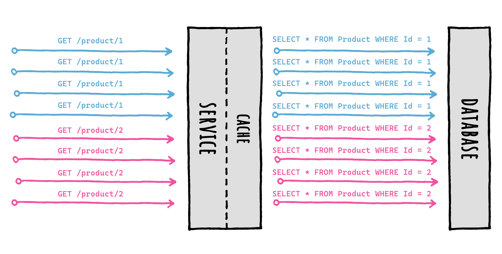
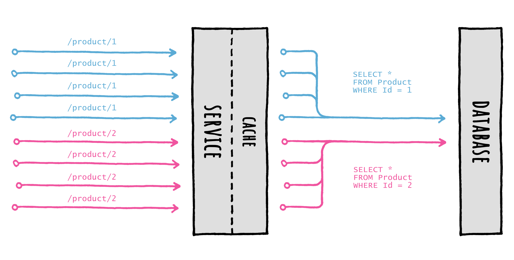
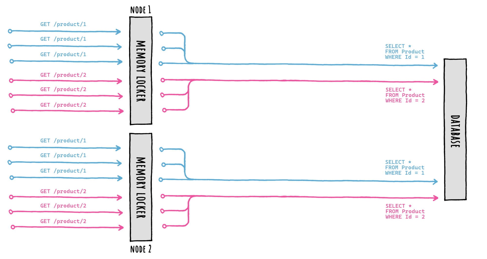

<div align="center">


</div>

# 🛡️ Cache Stampede protection

| ⚡ TL;DR (quick version) |
| -------- |
| FusionCache automatically prevents multiple factories running at the same time for the same cache key, no need to do anything. |

A [Cache Stampede](https://en.wikipedia.org/wiki/Cache_stampede) is a typical failure you may encounter while using caching in a high load scenario, and basically it's what happens when a lot of requests comes in for the same data at the same time and there's no special handling of that.

Imagine multiple requests coming in, all for the same data at the same moment. They would:

- all go to the cache to check for the same data
- all would not find anything in the cache
- all would then go to the database to get fresh data
- and finally, all would save the same fresh piece of data in the cache

all of them at the same time, for the same data.



Now imagine that scenario with 100 or 1.000 concurrent requests: that is both a waste of resources and something that may potentially tear down your database during peak traffic time.

FusionCache takes great care in coordinating the execution of concurrent factories for the same cache key, to avoid this type of failure altogether.

Inside FusionCache a factory is just a function that you specify when using the main `GetOrSet[Async]` method: basically it's the way you specify **how to get a value** when it is not in the cache or is expired.

### 👩‍💻 Example

```csharp
var id = 42;

var product = cache.GetOrSet<Product>(
    $"product:{id}",
    _ => GetProductFromDb(id), // THIS IS THE FACTORY
    options => options.SetDuration(TimeSpan.FromMinutes(1))
);
```

## 🔢 Request Coalescing

FusionCache will search for the value in the cache (*memory* and *distributed*, if available) and, if nothing is there, will call the factory to obtain the value: it then saves it into the cache with the specified options, and returns it to the caller, all transparently.

Special care is put into calling just one factory per key, concurrently, thanks to something known as *request coalescing*, which is a fancy way of saying that multiple identical requests at the same time will be reduced to just one request.

This means that if 10 (or 100, or more) concurrent requests for the same cache key arrive at the same time and the data is not there, **only one factory** will be executed, and the result will be stored and shared with all callers right away.



As you can see, when multiple concurrent `GetOrSet[Async]` calls are made for the same key, only 1 of them will be executed: the returned value will be cached to be readily available, and then returned to all the callers for the same cache key.

This ensures that the data source (let's say a database) **will not be overloaded** with multiple requests for the same piece of data at the same time.

All of this works not just in the normal flow (cache miss -> factory -> return) but also with other more advanced features like:
- [🦅 Eager Refresh](EagerRefresh.md): cache hit (after the eager refresh threshold) -> return + background factory
- [⏱️ Factory Timeouts](Timeouts.md): cache miss -> factory -> timeout -> return + background complete

No need for any special care, it all just works.

And how?

Thanks to a component called memory locker.

## 🔒 Memory Locker

The memory locker is the component responsible for coordinating the cache calls and the factory execution.

The abstraction is called `IFusionCacheMemoryLocker`, and we can provide any implementation for it, even a custom one created by ourself.

So, what do we need to do?

Nothing, since FusionCache by default automatically uses a standard implementation called `StandardMemoryLocker`.

Meaning when we do this:

```c#
services.AddFusionCache();
```

Everything is ready to go, which is pretty nice.

As said, we can even specify a custom memory locker, for example like this:

```c#
// DIRECT INSTANCE
services.AddFusionCache()
    .WithMemoryLocker(new MyMemoryLocker());
```

Nice.


## 🛡️ Distributed Cache Stampede

But, as the name implies, the **memory** locker only works locally, in **memory**.

So what happens if we need to scale horizontally, on multiple instances/nodes/pods?

First thing: thanks to the L2 (distributed cache) data will be shared among multiple nodes, all automatically.

But what if we are really "unlucky"?

What if the same data is requested on multiple nodes at the same time and the data is expired on all of them?

Well, if we were this unlucky multiple factories could run at the same time for the same cache key on different nodes.

Meaning, this:



The stampede protection based on the memory locker will protect us only locally: only one database query will be executed per-node, but each node will query the database separately, because FusionCache has no way of coordinating with the others in a mutually exclusive way.

So , is there something we can do?

Yes, we can specify a so-called **distributed locker**.


## 🔒 Distributed Locker

If during setup we specify a distributed locker, this happens:


By providing an `IFusionCacheDistributedLocker` implementation during setup, FusionCache will take care of everything, we don't have to do anything else.

The setup looks like this:

```c#
services.AddFusionCache()
    // ...
	.WithDistributedLocker(
		new RedisDistributedLocker(new RedisDistributedLockerOptions
		{
			Configuration = "localhost:6379",
		})
	);
```

Or, for a complete example, like this:

```c#
services.AddFusionCache()
	// SERIALIZER
	.WithSerializer(
		new FusionCacheSystemTextJsonSerializer()
	)
	// DISTRIBUTED CACHE
	.WithDistributedCache(
		new RedisCache(new RedisCacheOptions
		{
			Configuration = "localhost:6379",
		})
	)
	// BACKPLANE
	.WithBackplane(
		new RedisBackplane(new RedisBackplaneOptions
		{
			Configuration = "localhost:6379",
		})
	)
	// DISTRIBUTED LOCKER <-- HERE IT IS!
	.WithDistributedLocker(
		new RedisDistributedLocker(new RedisDistributedLockerOptions
		{
			Configuration = "localhost:6379",
		})
	);
```

Or, even better, if we want to re-use the same connection multiplexer for better performanceand use of resources, we can do this:

```c#
var muxer = ConnectionMultiplexer.Connect("localhost:6379");

services.AddFusionCache()
	// SERIALIZER
	.WithSerializer(
		new FusionCacheSystemTextJsonSerializer()
	)
	// DISTRIBUTED CACHE
	.WithDistributedCache(
		new RedisCache(new RedisCacheOptions
		{
			ConnectionMultiplexerFactory = async () => muxer,
		})
	)
	// BACKPLANE
	.WithBackplane(
		new RedisBackplane(new RedisBackplaneOptions
		{
			ConnectionMultiplexerFactory = async () => muxer,
		})
	)
	// DISTRIBUTED LOCKER <-- HERE IT IS!
	.WithDistributedLocker(
		new RedisDistributedLocker(new RedisDistributedLockerOptions
		{
			ConnectionMultiplexerFactory = async () => muxer,
		})
	);
```

Everything is ready to go, which is pretty nice.

> [!NOTE]
> In this case it's the Redis-based implementation, but we can use any other implementation, even a custom one made by ourself, just like with the memory locker.

## 📦 Packages

These are the main `IFusionCacheMemoryLocker` implementations available (the default one requires no separate package):

| Package Name                   | License | Version |
|--------------------------------|:---------------:|:---------------:|
| [ZiggyCreatures.FusionCache.Locking.AsyncKeyed](https://www.nuget.org/packages/ZiggyCreatures.FusionCache.Locking.AsyncKeyed/) <br/> Uses the AsyncKeyedLock library | [](https://www.nuget.org/packages/ZiggyCreatures.FusionCache.Locking.AsyncKeyed/) |  |

These are the main `IFusionCacheDistributedLocker` implementations available:

| Package Name                   | License | Version |
|--------------------------------|:---------------:|:---------------:|
| [ZiggyCreatures.FusionCache.Locking.Distributed.Redis](https://www.nuget.org/packages/ZiggyCreatures.FusionCache.Locking.Distributed.Redis/) <br/> An implementation for Redis | `MIT` | [](https://www.nuget.org/packages/ZiggyCreatures.FusionCache.Locking.Distributed.Redis/) |
| [ZiggyCreatures.FusionCache.Locking.Distributed.Memory](https://www.nuget.org/packages/ZiggyCreatures.FusionCache.Locking.Distributed.Memory/) <br/> An in-memory implementation (manily for testing) | `MIT` | [](https://www.nuget.org/packages/ZiggyCreatures.FusionCache.Locking.Distributed.Memory/) |


## 🤔 But is it really necessary?

Here's a curved ball: is it really important to use a distributed locker when using multiple nodes?

The answer is: "it depends" (because of course it is😅).

Jokes aside: the memory locker is fundamental, but the distributed locker... less so.

But why?

Consider this example:
- `100,000` concurrent requests hit our service for the same data at the same time
- the data is not in the cache (cache miss)
- we scaled horizontally, let's say on `10` instances/nodes/pods

So we would have:
- no stampede protection: `100,000` database queries
- local stampede protection: at most `10` database queries, if we are unlucky
- local + distributed protection: only `1`

Going from `100,000` concurrent database queries to `10` it's bonkers, it's a day/night difference.

Going from `10` to `1` concurrent database queries... less so.

Don't get me wrong, it's still nice: but everything has a cost, and using a distributed lock to coordinate multiple machines running remotely is no exception. And all to go, as in our example, from `10` to `1` database query?

As always: we need to balance things out.

We need to think about how expensive the database query is, and how bad can it really be to run it - if we are unlucky - a couple more times instead of only once.

Think about it this way: without caching at all, all requests to our service would make a database query. That would not be "wrong", just a potential waste of resources.

So if instead of `1` query we execute `2` or `3` or `10`, that would not make it "wrong".

All in all, if it's not critical I would say don't bother using a distributed locker.

## ⚙️ Granular control

Luckily for us, we don't need to decide upfront yes or no for the entire cache.

We can go granular.

A `SkipDistributedLocker` entry option is available, per-call: this means we can set it for the entire cache (via `DefaultEntryOptions`) and later change it only for some calls.

Here's an example:

```c#
var product = await cache.GetOrSetAsync<Product>(
    "product:42",
    async _ => await GetProductFromDb(42),
    options => options.SetSkipDistributedLocker(true)
);
```

Nice.


## ⚠️ Efficiency VS Correctness

One final thing, which is very important.

The way the distributed coordination in FusionCache is achieved is through distributed locking.

And distributed locking is a peculiar thing, with some peculiar settings and tradeoffs picked for different reasons.

But here's the thing: we should not confuse *what* we are trying to achieve with *how*.

People may *directly* use distributed locking for *correctness*, for example to be sure that only one method will be executed in a distributed environment.

Instead, what FusionCache is aiming for here is *efficiency*, not correctness: it is trying to reduce the number of concurrent database queries, that's all. And it's *indirectly* using distributed locking as a way to achieve that.

Long story short: don't use the the distributed stampede protection as a locking mechanism.

It may work *most* of the times or even *all* the times, but that would be the wrong architectural and design decision.

My 2 cents.
