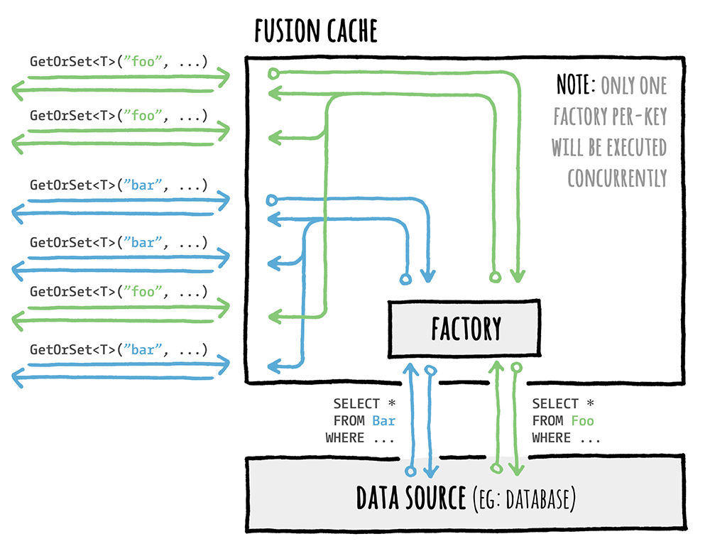

<div align="center">


</div>

# :rocket: Cache Stampede prevention

A [Cache Stampede](https://en.wikipedia.org/wiki/Cache_stampede) is a typical failure you may encounter while using caching in a high load scenario, and basically it's what happens when a lot of requests comes in for the same data and there's no special handling of that.

## The Problem

Imagine multiple requets coming in, all for the same data. They would:

- all go to the cache to check for the same data
- all not find that in the cache
- then they would all go to the database
- and finally they would all save the same fresh piece of data in the cache

all of them at the same time, for the same data.

Now imagine that scenario with 100 or 1.000 concurrent requests: that is both a waste of resources and something that may potentially tear down your database during peak traffic time.

## The Solution

FusionCache takes great care in coordinating the execution of concurrent factories for the same cache key, to avoid this type of failure altogether.

Inside FusionCache a factory is just a function that you specify when using the main `GetOrSet[Async]` method: basically it's the way you specify **how to get a value** when it is not in the cache or is expired.

Here's an example:

```csharp
var id = 42;

var product = cache.GetOrSet<Product>(
    $"product:{id}",
    _ => GetProductFromDb(id), // THIS IS THE FACTORY
    options => options.SetDuration(TimeSpan.FromMinutes(1))
);
```

FusionCache will search for the value in the cache (*memory* and *distributed*, if available) and, if nothing is there, will call the factory to obtain the value: it then saves it into the cache with the specified options, and returns it to the caller, all transparently.

Special care is put into calling just one factory per key, concurrently: this means that if 10 (or 100, or more) concurrent requests for the same key arrive at the same time and the data is not there, **only one factory** will be executed, and the result will be stored and shared with all callers right away.



As you can see, when multiple concurrent `GetOrSet[Async]` calls are made for the same key, only 1 of them will be executed: the returned value will be cached to be readily available, and then returned to all the callers for the same cache key.

This ensures that the data source (let's say a database) **will not be overloaded** with multiple requests for the same piece of data at the same time.


## Lock Timeout

Although most probably it's not something needed in any reasonable scenario, it is nonetheless possible to manually specify a `LockTimeout` in case you want to be extra sure that you prefer multiple connections to the database for the same data at the same time, instead of waiting for the first one that have been able to acquire the lock but may be stuck for some reason.

As said this should not be needed in any reasonable scenario but, just as an example, a rare one that has been observed in a real world production environment is a query stuck in a deadlock or similar, for data that would be served by another query, maybe processed by another request. Another similar situation is when the remote data source is not a normal database but a web service operated in a multi-node environment: the request that obtained the lock may be served by a node that is having problems, whereas another node may responde quickly.

Again, very very rare but just in case, the `LockTimeout` option is here to help.


## Multiple nodes

It's right to point out that this automatic coordination does not extend accross multiple nodes: what this means is that although there's a guarantee only 1 factory will be executed concurrently per-key in each node, if multiple requests for the same cache key arrive at the same time on different nodes, one factory per node will be executed.

In practice this is typically not a problem, because for example `1.000` concurrent requests distributed on `5` nodes means, if you are not lucky, at most `5` requests to the database: the cache stampede problem is still solved, you may just have a couple more executions, but not a massive number.

On top of that, one way to mitigate this scenario is to enable jittering via the `JitterMaxDuration` [option](Options.md): basically it's a way to add a little extra random duration to the normal cache duration, so that the same piece of data will expire at a little bit different times on each node, allowing the first node where it will expire to refresh the data from the database and repopulate the distributed cache for everybody else to use right away, and not go to the database.