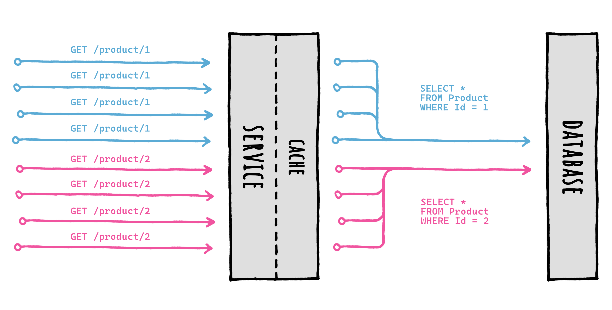

<div align="center">


</div>

# 🛡️ Cache Stampede prevention

| ⚡ TL;DR (quick version) |
| -------- |
| FusionCache automatically prevents multiple factories running at the same time for the same cache key, no need to do anything. |

A [Cache Stampede](https://en.wikipedia.org/wiki/Cache_stampede) is a typical failure you may encounter while using caching in a high load scenario, and basically it's what happens when a lot of requests comes in for the same data at the same time and there's no special handling of that.

Imagine multiple requests coming in, all for the same data at the same moment. They would:

- all go to the cache to check for the same data
- all would not find anything in the cache
- all would then go to the database to get fresh data
- and finally, all would save the same fresh piece of data in the cache

all of them at the same time, for the same data.


Now imagine that scenario with 100 or 1.000 concurrent requests: that is both a waste of resources and something that may potentially tear down your database during peak traffic time.

FusionCache takes great care in coordinating the execution of concurrent factories for the same cache key, to avoid this type of failure altogether.

Inside FusionCache a factory is just a function that you specify when using the main `GetOrSet[Async]` method: basically it's the way you specify **how to get a value** when it is not in the cache or is expired.

### 👩‍💻 Example

```csharp
var id = 42;

var product = cache.GetOrSet<Product>(
    $"product:{id}",
    _ => GetProductFromDb(id), // THIS IS THE FACTORY
    options => options.SetDuration(TimeSpan.FromMinutes(1))
);
```

## 🔢 Request Coalescing

FusionCache will search for the value in the cache (*memory* and *distributed*, if available) and, if nothing is there, will call the factory to obtain the value: it then saves it into the cache with the specified options, and returns it to the caller, all transparently.

Special care is put into calling just one factory per key, concurrently, thanks to something known as *request coalescing*, which is a fancy way of saying that multiple identical requests at the same time will be reduced to just one request.

This means that if 10 (or 100, or more) concurrent requests for the same cache key arrive at the same time and the data is not there, **only one factory** will be executed, and the result will be stored and shared with all callers right away.



As you can see, when multiple concurrent `GetOrSet[Async]` calls are made for the same key, only 1 of them will be executed: the returned value will be cached to be readily available, and then returned to all the callers for the same cache key.

This ensures that the data source (let's say a database) **will not be overloaded** with multiple requests for the same piece of data at the same time.


## 🔀 Multiple Nodes

It's right to point out that this automatic coordination does not extend accross multiple nodes: what this means is that although there's a guarantee only 1 factory will be executed concurrently per-key in each node, if multiple requests for the same cache key arrive at the same time on different nodes, one factory per node will be executed.

In practice this is typically not a problem, because for example `1.000` concurrent requests distributed on `5` nodes means, if you are not lucky, at most `5` requests to the database: the cache stampede problem is still solved, you may just have a couple more executions, but not a massive number.

Additionally, if we are using a distributed cache we should remember that as soon as a value will be returned from a factory it will also be saved to the distributed cache, ready to be used by the other nodes, avoiding the next database request at all.

On top of that, one extra way to mitigate this scenario is to enable jittering via the `JitterMaxDuration` [option](Options.md): basically it's a way to add a little extra random duration to the normal cache duration, so that the same piece of data will expire at a little bit different times on each node, allowing the first node where it will expire to refresh the data from the database and repopulate the distributed cache for everybody else to use right away, and not go to the database.
