# 🧬 Diagrams

Sometimes it's nice to be able to visualize the internal flow of a system.

This is true for any system, but even more so for such a complex beast as an hybrid cache, where the interplay between L1, an optional L2, an optional backplane and various features will come together to create a beautiful, but complex, result.

What follows are a couple of flow charts that tries to capture, from a more simplistic view to a comprehensive one, the main stages of what happens inside FusionCache for the main and most complex method: `GetOrSet`.

It should be noted that even the most complex one cannot capture the full extent of all the internal details such as background execution of distributed components, sync/async events, observability points (traces, metrics, etc) because visually representing such a big piece of complex code cannot be done in a reasonable way.

After a certain point we can just look directly at the code.

## L1 only (simplified)

This is a high level overview of the main parts when using only L1 (memory level): no L2 (distributed level) or backplane.

Also, the cache stampede protection is not shown here for simplicity, but rest assured **is always there**.

```mermaid
flowchart TD
    START[GetOrSet] -->
    
    CHECK_L1{✅ Value in L1?}
    CHECK_L1 -->|&nbsp;Yes&nbsp;| RETURN
    CHECK_L1 -->|&nbsp;No&nbsp;| FACTORY

    FACTORY[⚡ Execute factory]
    FACTORY --> SAVE_L1

    SAVE_L1[💾 Save to L1]
    SAVE_L1 --> RETURN
    
    RETURN[Return value]
```

## L1 + L2 + Backplane (simplified)

The level of detail is the same as the one before, but here we include the optional L2 and the backplane for multi-node synchronization.

Again, for simplicify the cache stampede protection mechanism is not shown, but **is always there**.

```mermaid
flowchart TD
    START[GetOrSet] -->
    
    CHECK_L1{✅ Value in L1?}
    CHECK_L1 -->|&nbsp;Yes&nbsp;| RETURN
    CHECK_L1 -->|&nbsp;No&nbsp;| CHECK_L2

    CHECK_L2{✅ Value in L2?}
    CHECK_L2 -->|&nbsp;Yes&nbsp;| SAVE_L1
    CHECK_L2 -->|&nbsp;No&nbsp;| FACTORY

    SAVE_L1[💾 Save to L1]
    SAVE_L1 --> RETURN

    FACTORY[⚡ Execute factory]
    FACTORY --> FACTORY_SAVE_L1

    FACTORY_SAVE_L1[💾 Save to L1]
    FACTORY_SAVE_L1 --> SAVE_L2
    
    SAVE_L2[💾 Save to L2]
    SAVE_L2 --> SEND_BACKPLANE
    
    SEND_BACKPLANE[📢 Send backplane notification]
    SEND_BACKPLANE --> RETURN

    RETURN[Return value]
```

## L1 only (simplified, with stampede protection)

This is the same as the first one, but the cache stampede protection steps are also shown to have a better understanding of that part.

> [!NOTE]
> Note the use of the classic double checked lock: after we get the lock we check L1 again, since some other caller may have already updated L1 for us.

```mermaid
flowchart TD
    START[GetOrSet] -->
    
    CHECK_L1{✅ Value in L1?}
    CHECK_L1 -->|&nbsp;Yes&nbsp;| RETURN
    CHECK_L1 -->|&nbsp;No&nbsp;| STAMPEDE_LOCK_ACQUIRE

    STAMPEDE_LOCK_ACQUIRE[🔒 Acquire stampede lock]
    STAMPEDE_LOCK_ACQUIRE --> CHECK_L1_2
    
    CHECK_L1_2{✅ Value in L1?}
    CHECK_L1_2 -->|&nbsp;Yes&nbsp;| STAMPEDE_LOCK_RELEASE
    CHECK_L1_2 -->|&nbsp;No&nbsp;| FACTORY

    FACTORY[⚡ Execute factory]
    FACTORY --> SAVE_L1

    SAVE_L1[💾 Save to L1]
    SAVE_L1 --> STAMPEDE_LOCK_RELEASE
    
    STAMPEDE_LOCK_RELEASE[🔓 Release stampede lock]
    STAMPEDE_LOCK_RELEASE --> RETURN
    
    RETURN[Return value]
```

## L1 + L2 + Backplane + Eager Refresh + Soft Timeout

This is the most comprehensive one.

As said, it cannot contain every little detail of every little feature and every possible combination of options, otherwise it would be a gargantuan monster as big as Stephen Toub's annual perf [blogposts](https://devblogs.microsoft.com/dotnet/performance-improvements-in-net-9/) 😅.

Having said that, it should be a quite complete picture of the finer inner steps, enough for anyone to get familiar with how  everything works.

> [!NOTE]
> It's possible to execute some distributed operations (L2 and Backplane) in the background to speed things up via `AllowBackgroundDistributedCacheOperations` and `AllowBackgroundDistributedCacheOperations` options: in that case those parts will not be blocking, but I'm not showing both here to avoid the diagram becoming even bigger.

```mermaid
flowchart TD
    START[GetOrSet] -->
    
    CHECK_L1{✅ Value in L1?}
    CHECK_L1 -->|&nbsp;Yes&nbsp;| EAGER_MAYBE
    CHECK_L1 -->|&nbsp;No&nbsp;| STAMPEDE_LOCK_ACQUIRE

    EAGER_MAYBE{✅ Eager refresh?}
    EAGER_MAYBE -->|&nbsp;Yes&nbsp;| EAGER_STAMPEDE_LOCK_ACQUIRE
    EAGER_MAYBE -->|&nbsp;No&nbsp;| RETURN

    EAGER_STAMPEDE_LOCK_ACQUIRE[🔒 Acquire stampede lock]
    EAGER_STAMPEDE_LOCK_ACQUIRE --> EAGER_FACTORY
    EAGER_STAMPEDE_LOCK_ACQUIRE --> RETURN

    EAGER_FACTORY[⚡ Execute background factory]
    EAGER_FACTORY --> EAGER_NEW_VALUE_FACTORY

    EAGER_NEW_VALUE_FACTORY[🆕 New value from factory]
    EAGER_NEW_VALUE_FACTORY --> EAGER_SAVE_L1

    EAGER_SAVE_L1[💾 Save to L1]
    EAGER_SAVE_L1 --> EAGER_STAMPEDE_LOCK_RELEASE
    
    EAGER_STAMPEDE_LOCK_RELEASE[🔓 Release stampede lock]
    EAGER_STAMPEDE_LOCK_RELEASE --> EAGER_SAVE_L2

    EAGER_SAVE_L2[💾 Save to L2]
    EAGER_SAVE_L2 --> EAGER_SEND_BACKPLANE

    EAGER_SEND_BACKPLANE[📢 Send backplane notification]

    STAMPEDE_LOCK_ACQUIRE[🔒 Acquire stampede lock]
    STAMPEDE_LOCK_ACQUIRE --> CHECK_L1_2
    
    CHECK_L1_2{✅ Value in L1?}
    CHECK_L1_2 -->|&nbsp;Yes&nbsp;| STAMPEDE_LOCK_RELEASE
    CHECK_L1_2 -->|&nbsp;No&nbsp;| CHECK_L2

    CHECK_L2{✅ Value in L2?}
    CHECK_L2 -->|&nbsp;Yes&nbsp;| SAVE_L1
    CHECK_L2 -->|&nbsp;No&nbsp;| FACTORY

    FACTORY[⚡ Execute factory]
    FACTORY --> MAYBE_TIMEOUT

    MAYBE_TIMEOUT{🕑 Timeout?}
    MAYBE_TIMEOUT -->|&nbsp;No&nbsp;| NEW_VALUE_FACTORY
    MAYBE_TIMEOUT -->|&nbsp;Yes&nbsp;| FAILSAFE

    FAILSAFE[💣 Activate fail-safe]
    FAILSAFE --> NEW_VALUE_FAILSAFE
    FAILSAFE --> TIMEOUT_FACTORY

    TIMEOUT_FACTORY[⚡ Complete background factory]
    TIMEOUT_FACTORY --> TIMEOUT_NEW_VALUE_FACTORY

    TIMEOUT_NEW_VALUE_FACTORY[🆕 New value from factory]
    TIMEOUT_NEW_VALUE_FACTORY --> TIMEOUT_SAVE_L1

    TIMEOUT_SAVE_L1[💾 Save to L1]
    TIMEOUT_SAVE_L1 --> TIMEOUT_SAVE_L2
    
    TIMEOUT_SAVE_L2[💾 Save to L2]
    TIMEOUT_SAVE_L2 --> TIMEOUT_SEND_BACKPLANE

    TIMEOUT_SEND_BACKPLANE[📢 Send backplane notification]

    NEW_VALUE_FACTORY[🆕 New value from factory]
    NEW_VALUE_FACTORY --> SAVE_L1

    NEW_VALUE_FAILSAFE[🆕 New value from fail-safe]
    NEW_VALUE_FAILSAFE --> SAVE_L1

    SAVE_L1[💾 Save to L1]
    SAVE_L1 --> STAMPEDE_LOCK_RELEASE
    
    STAMPEDE_LOCK_RELEASE[🔓 Release stampede lock]
    STAMPEDE_LOCK_RELEASE --> MAYBE_NEW_VALUE

    MAYBE_NEW_VALUE{✅ New value?}
    MAYBE_NEW_VALUE -->|&nbsp;No&nbsp;| RETURN
    MAYBE_NEW_VALUE -->|&nbsp;Yes&nbsp;| SAVE_L2

    SAVE_L2[💾 Save to L2]
    SAVE_L2 --> SEND_BACKPLANE

    SEND_BACKPLANE[📢 Send backplane notification]
    SEND_BACKPLANE --> RETURN

    RETURN[Return value]
```

