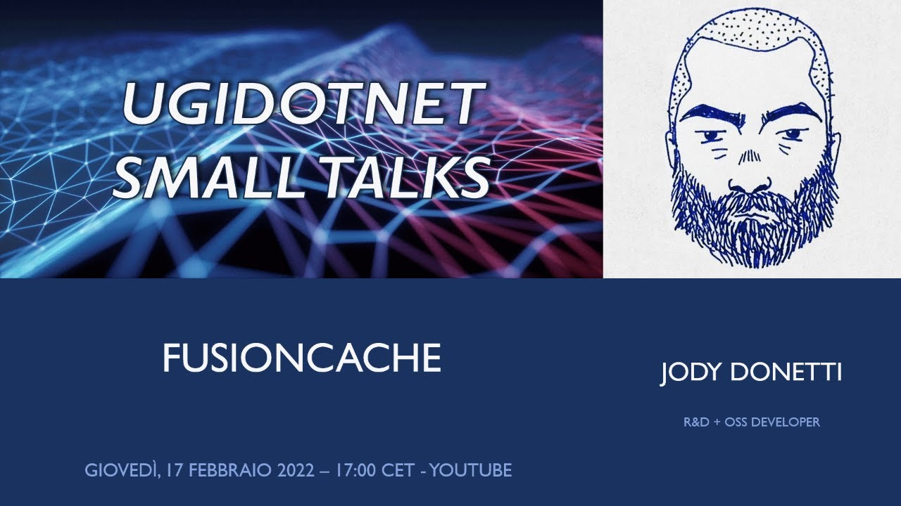

# 📺 Media

I've been lucky enough to have been invited to some lives, podcasts and shows to talk about caching and FusionCache.

If you are more into videos than text, here's a list you may enjoy.

 

 

## English Language

### On .NET (2024)

The fine folks at [On .NET](https://learn.microsoft.com/en-us/shows/on-net/) have been kind enough to invite me on the show and listen to me mumbling random caching stuff.

This is a very good introduction on the general approach and features of FusionCache, but also a useful overview of caching concepts in general.

### Open At Microsoft (2024)

In this quick talk with [Davide Mauri](https://twitter.com/mauridb) we introduced FusionCache to the audience of Open at Microsoft.

Quick and to the point.

### Data Exposed (2022)

The great [Anna Hoffman](https://twitter.com/analyticanna) has been so nice to listen to me mumble random stuff about caching on [Data Exposed](https://learn.microsoft.com/en-us/shows/data-exposed/caching-made-easy-in-azure-sql-db-with-fusioncache-data-exposed).

Thanks Anna!

 

 

## Italian Language 🤌

### Live Coding - Alla Scoperta Di FusionCache (2025)

Marco Minerva invited me for a talk with his viewers on all things FusionCache.

### DotNetConf Italia (2024)

I've been lucky enough to be selected for a session at the italian version of DotNetConf, where I talked about, you guessed it, hybrid caching in .NET

### Continuous Delivery (2024)

The fine folks at Continuous Delivery (by [SparkFabrik](https://www.sparkfabrik.com/it/)) invited me to talk about my experience with open source in general, and FusionCache in particular.

Oh, and also about Genziana and arrosticini 🙂

### Spike Time (2024)

[Alberto Mori](https://twitter.com/albx87) invited me on his Spike Time, where I've been able to see him move his first steps with FusionCache, live, unfiltered. A really nice experience that also ended up making FusionCache even better.

Thanks Alberto!

### Small Talks (2022)

The great [Roberto Messora](https://twitter.com/robymes) invited me to UgiDotNet's show Small Talks: of course the subject was FusionCache and caching in general.

Thanks Roberto!

### dotNET{podcast} (2022)

The awesome [Mauro Servienti](https://twitter.com/mauroservienti) invited me to his podcast to talk about FusionCache.

It has been a really nice talk about all things caching, thanks Mauro!

