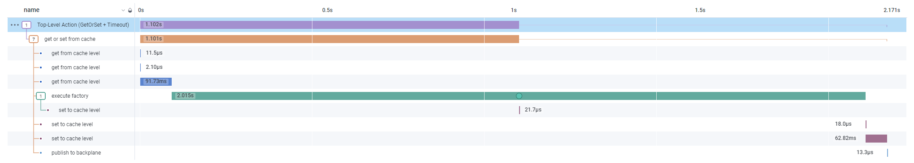

<div align="center">


</div>


# 🔭 OpenTelemetry

| ⚡ TL;DR (quick version) |
| -------- |
| Full observability of traces and metrics is done via native [OpenTelemetry](OpenTelemetry.md) support: simply enable it at setup time and it will just work. In the same spirit, it's also possible to do extensive [logging](Logging.md). |

Observability is a key feature of modern software systems that allows us to clearly see what is going on at any given time.

It is composed from 3 main _signals_:
- Logs
- Traces
- Metrics

FusionCache has rich [logging](Logging.md) support via the standard [ILogger](https://learn.microsoft.com/en-us/dotnet/core/extensions/logging) interface, with various options available to granularly configure it.

For metrics and traces though, no unified abstraction has ever been available for app and library authors to produce signals, and 3rd party services to consume them, in a consistent and cross-platform way.

That changed when [OpenTelemetry](https://opentelemetry.io/) has been introduced.

From some time now OpenTelemetry has become a fundamental staple in modern software development to bring complete observability to our applications: after the official standard, the semantic conventions and all the needed pieces finally become `v1.0`, FusionCache happily adopted it as *the* observability mechanism.

This is an example of the visibility we can achieve, in this case in [Honeycomb.io](Honeycomb):



ℹ️ Please note that I don't have any affiliation, partnership or else with Honeycomb: I just created a free trial to test the OpenTelemetry integration.

Other than that I've used a couple of their free [Observability Office Hours](https://www.honeycomb.io/devrel/observability-office-hours) to chat with the awesome [Martin Thwaites](https://twitter.com/MartinDotNet) to better understand the right way to name activity sources, which tags to use in the metrics and so on: thanks Martin!

## OpenTelemetry in .NET

Normally in other languages there's an OpenTelemetry SDK being made available by the kind folks working on it, so that library authors can use that SDK to integrate into the OpenTelemetry world and communicate with processors, exporters and so no.

This is also true for .NET, but with a nice catch: in .NET there's always been some form of observability support via core primitives like `Activity`, `ActivitySource`, `Meter` and similar classes already part of the BCL, so instead of creating new primitives the OpenTelemetry team decided to use the existing abstractions and "talk" to them: in this way it's possible for library authors **not** to take a hard dependency on the OpenTelemetry packages and simply use the existing primitives and have the consuming side of the whole OpenTelemetry pipeline interact with them.

Nice, very nice, and this is what FusionCache did.

## How to use it

It is possible to opt-in to generate traces and metrics for both:
- **high-level operations**: things like `GetOrSet`/`Set`/`Remove` operations, `Hit`/`Miss` events, etc
- **low-level operations**: things like memory/distributed level operations, backplane events, etc

There's also a new [package](https://www.nuget.org/packages/ZiggyCreatures.FusionCache.OpenTelemetry/) specific for OpenTelemetry that adds native support to instrument our applications, with FusionCache specific options ready to use, like including low-level signals or not.

It's then possible to simply plug one of the existing OpenTelemetry-compatible exporters for systems like [Jaeger](https://www.jaegertracing.io/), [Prometheus](https://prometheus.io/) or [Honeycomb](https://www.honeycomb.io/) and voilà, there we have full observability of our FusionCache instances.

### 👩‍💻 Example

Add the [package](https://www.nuget.org/packages/ZiggyCreatures.FusionCache.OpenTelemetry/):

```PowerShell
PM> Install-Package ZiggyCreatures.FusionCache.OpenTelemetry
```

and enable either traces, metrics or both for FusionCache.

Without dependency injection we can do this:

```csharp
// SETUP TRACES
using var tracerProvider = Sdk.CreateTracerProviderBuilder()
  .AddFusionCacheInstrumentation()
  .AddConsoleExporter()
  .Build();

// SETUP METRICS
using var meterProvider = Sdk.CreateMeterProviderBuilder()
  .AddFusionCacheInstrumentation()
  .AddConsoleExporter()
  .Build();
```

Or via dependency injection, like this:

```csharp
services.AddOpenTelemetry()
  // SETUP TRACES
  .WithTracing(tracing => tracing
    .AddFusionCacheInstrumentation()
    .AddConsoleExporter()
  )
  // SETUP METRICS
  .WithMetrics(metrics => metrics
    .AddFusionCacheInstrumentation()
    .AddConsoleExporter()
  );
```

Easy peasy.
