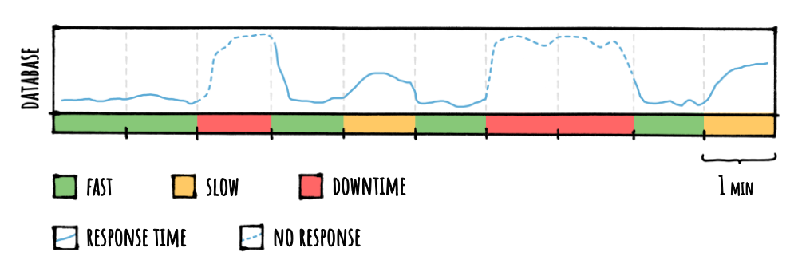

<div align="center">


</div>

# 👩‍🏫 Step By Step

What follows is an example scenario on which we can reason about: we've built a **service** that handle some **requests** by retrieving some data from a **database**, that's it.

The hypothetical infrastructure involved is somewhat bad on purpose, and is used just to illustrate some points like why a cache is useful in general, what FusionCache in particular can do, and also to have some nice round numbers to play with.

<br/>
<br/>

## The scenario

Imagine we have our simple ASP.NET Core service receiving requests to get product informations by ID and to do that it connects to a database.

Easy peasy.

We observe it over a **10 min** period, where the database will be sometimes **fast** to respond, sometimes **slow** and sometimes would just be totally **down**, maybe with excessive timeouts due to overloading, network congestion issues towards the database or anything else.

So, something like this:



In the **10 min** period suppose we have a nice, uniform usage pattern where **every 10 sec** this happens:

- **`1,000` different products** get requested to our service (so `1,000` different product ids)
- **`100` concurrent requests** per each single product
- **`100` ms** of average response time from the database, with sometimes peaks of **1 sec**
- our service is deployed on **`3` nodes** to better handle the traffic

| **:bulb: NOTE** |
|:----------------|
| It's important to say upfront that this is both **overly simplified** and (hopefully) **more disastrous** than a typical real world scenario. On one side not everything would be so beautifully synchronized and so perfectly periodical about requests pattern, while on the other I hope you don't have to deal with a database that, on a 10 minutes range, is slow for 2 minutes and completely down for 3 :sweat_smile: |

<br/>
<br/>

## Initial Code

In our code we have a method that goes to the database to fetch what is needed:

```csharp
public Product GetProductFromDb(int id) {
    // YOUR DATABASE CALL HERE
}
```

For this example we'll use the classic **sync** programming model, but it would be even better with the **async** one and would most probably give you better performance: just sprinkle some `await` usage here and there and call the `async` version of each method, and everything would be fine.

Then we have a **controller** with an **action** like this:

```csharp
[HttpGet("product/{id}")]
public ActionResult<Product> GetProduct(int id)
{
    var product = GetProductFromDb(id);

    if (product is null)
        return NotFound();

    return product;
}
```

I know, I know, nobody would be such a mad lad not to use any form of caching at all, but this serves just a starting point.

### 🏆 Results

Without any form of caching, this would give us `1,000` products requested X `100` concurrent requests per each product X `3` nodes = `300,000` req every 10 sec so `1,800,000` req/min.

**TOTAL REQUESTS IN 10 MIN**: `18,000,000` .

As we can see, every time the database is slow or down our service will be slow or down, too: this is because there's nothing between the database and our service.


<br/>
<br/>

## 1) MemoryCache

To add a memory cache we go in the `ConfigureServices` method in the `Startup.cs` file and add this:

```csharp
public void ConfigureServices(IServiceCollection services)
{
    services.AddMemoryCache();
}
```

Then we go in our controller and add an `IMemoryCache` param to the constructor, saving it in a private field:

```csharp
public class MyController : Controller
{
    private IMemoryCache _cache;

    public MyController(IMemoryCache cache)
    {
        _cache = cache;
    }

    // [...]
```

and, in the action, we simply use the `GetOrCreate<T>` with a *1 min* cache duration:

```csharp
[HttpGet("product/{id}")]
public ActionResult<Product> GetProduct(int id)
{
    var product = _cache.GetOrCreate<Product>(
        $"product:{id}",
        entry => {
            entry.SetAbsoluteExpiration(TimeSpan.FromMinutes(1));
            return GetProductFromDb(id);
        }
    );

    if (product is null)
        return NotFound();

    return product;
}
```

### 🏆 Results

Just adding a simple memory cache and caching results from the database for **1 min** means that for that whole minute we would not go to the database at all, giving us `1,000` products requested X `100` concurrent requests per each product X `3` nodes = `300,000` req/min, so `3,000,000` requests in `10` min.

Plus, for the `3` minutes when the database is down, nothing will be cached since the factory would throw an exception so in those `3` minutes, all of the `1,000` X `100` X `3` = `300,000` requests will keep being executed every `10` seconds, for an additional `9,000,000` requests.

**TOTAL REQUESTS IN 10 MIN**: `12,000,000` (before was `18,000,000`)

Also, since we are reducing a little bit the number of requests to the database, it will respond a little bit quicker than before, reducing the response time of our own service as well, making it slightly faster.


<br/>
<br/>

## 2) FusionCache

In the previous step we would still have one big problem: **multiple concurrent executions of the same factory** for the same product id.

You see, the moment something is not in the cache (or is expired) every request will go to the database: in our example we have **100 concurrent requests** per each product arriving at the same time, so every single one of them would go to the database whereas it would be sufficient for just one of them to go to the database - per product id - and as soon as having the result from the database every other request for the same product id should be satisfied with the same result.

This is a problem of factory execution coordination, and **FusionCache** will solve that for us, automatically.

To use FusionCache we simply install the package via the nuget UI (search for the `ZiggyCreatures.FusionCache` package) or via the nuget package manager console:

```PowerShell
PM> Install-Package ZiggyCreatures.FusionCache
```

Then we go in the `Startup.cs` file and register it after the `MemoryCache` registration we already added before:

```csharp
public void ConfigureServices(IServiceCollection services)
{
    services.AddMemoryCache();
    services.AddFusionCache();
}
```

Finally, we go in our **controller** and change the constructor param from an `IMemoryCache` to an `IFusionCache` :


```csharp
public class MyController : Controller
{
    private IFusionCache _cache;

    public MyController(IFusionCache cache)
    {
        _cache = cache;
    }

    // [...]
```

and slightly change the call in the **action**, like this:

```csharp
[HttpGet("product/{id}")]
public ActionResult<Product> GetProduct(int id)
{
    var product = _cache.GetOrSet<Product>(
        $"product:{id}",
        _ => GetProductFromDb(id),
        options => options.SetDuration(TimeSpan.FromMinutes(1))
    );

    if (product is null)
        return NotFound();

    return product;
}
```

One last thing: if we like `1 min` to be our default cache duration, we can specify that in the registration, like this:

```csharp
services.AddFusionCache()
    .WithDefaultEntryOptions(new FusionCacheEntryOptions {
        // CACHE DURATION
        Duration = TimeSpan.FromMinutes(1)
    })
;
```

and then we can avoid to specify the duration in each call, leaving us with this:

```csharp
var product = _cache.GetOrSet<Product>(
    $"product:{id}",
    _ => GetProductFromDb(id)
);
```

### 🏆 Results

Just adding FusionCache without doing any extra activity will solve the factory coordination problem we described above so that **only 1 factory** will be executed concurrently per each product id.

This will give us `1,000` products requested X `1` factory executed per each product (instead of `100`) X `3` nodes = `3,000` req/min, for a total of `30,000`requests.

Plus, we still have the problem related to those `3` minutes when the database is down, but this time only `1` factory will be called per product instead of `100`, for an additional `1,000` X `3` = `3,000` requests that will keep being executed every `10` seconds, for an additional `90,000` requests.

**TOTAL REQUESTS IN 10 MIN**: `120,000` (before was `12,000,000`)

And again, reducing the number of requests to the database (this time by a lot) will have a cascading effect of making the database and our own service a lot faster.


<br/>
<br/>

## 3) Fail-Safe ([more](FailSafe.md))

Looking at the colors in the graph above we can see we still have a big problem: when the database is down our service is also down (the **red** parts).

To solve this issue we can enable one of the main features of FusionCache: **Fail-Safe**.

[**Fail-Safe**](FailSafe.md) is a mechanism that allows the re-use of expired entries in the cache when calling the factory (in our case calling the database) goes wrong. To do that we simply set 3 things:

- `IsFailSafeEnabled`: we set this flag to `true`
- `FailSafeMaxDuration`: we specify for how long a value should be usable, even after its logical expiration (say `2 hours`)
- `FailSafeThrottleDuration`: we also specify for how long an expired value used because of a fail-safe activation should be considered temporarily non-expired, to avoid going to check the database for every consecutive request of an expired value (let's say `30 seconds`)

We can do this very easily, either by specifying it per-call, maybe using the available **fluent api**, like this:

```csharp
var product = _cache.GetOrSet<Product>(
    $"product:{id}",
    _ => GetProductFromDb(id),
    options => options.SetFailSafe(true, TimeSpan.FromHours(2), TimeSpan.FromSeconds(30))
);
```

or, as before, by setting the `DefaultEntryOptions` object during the registration:

```csharp
services.AddFusionCache()
    .WithDefaultEntryOptions(new FusionCacheEntryOptions {
        Duration = TimeSpan.FromMinutes(1),
        
        // FAIL-SAFE OPTIONS
        IsFailSafeEnabled = true,
        FailSafeMaxDuration = TimeSpan.FromHours(2),
        FailSafeThrottleDuration = TimeSpan.FromSeconds(30)
    })
;
```

### 🏆 Results

Settings these 3 options will automatically **dissolve any downtime** in our service: look at graph, **no more red** :tada:

This is because any problem that may happen while calling the factory - in our case calling the database - to refresh an expired value in the cache will be handled transparently by giving us the expired value, temporarily.

Also, during those 3 minutes of database downtime we will still have a cached value to use (expired, but better than nothing) so only 2 call per minute, since we set `FailSafeThrottleDuration` to `30` sec.

This will give us `1,000` products requested X `1` factory executed X `3` nodes = `3,000` req/min, for a total of `30,000`requests in `10` min.

Plus `1` extra req for each product & node for each of the `3` min where the database is down, so another `9,000` requests.

**TOTAL REQUESTS IN 10 MIN**: `39,000` (before was `120,000`)


<br/>
<br/>

## 4) Factory Timeouts ([more](Timeouts.md))

The situation is now way better than how it was initially, but here and there we are still **a little slow** becuase of **some latency spikes** when we go to the database.

Wouldn't it be nice if FusionCache would simply give us back the expired value (if any) when a factory takes too long? Also the timed out factory should keep running in the background so that - if and when the factory successfully completes - it can immediately update the cache so that the new value would be available right away without waiting for the next expiration time to occur?

Luckily, just setting the [**factory timeouts**](Timeouts.md) does exactly that, so let's do it in the registration:

```csharp
services.AddFusionCache()
    .WithDefaultEntryOptions(new FusionCacheEntryOptions {
        Duration = TimeSpan.FromMinutes(1),
        
        IsFailSafeEnabled = true,
        FailSafeMaxDuration = TimeSpan.FromHours(2),
        FailSafeThrottleDuration = TimeSpan.FromSeconds(30),

        // FACTORY TIMEOUTS
        FactorySoftTimeout = TimeSpan.FromMilliseconds(100),
        FactoryHardTimeout = TimeSpan.FromMilliseconds(1500)
    })
;
```

From now on if a factory gets called **and there's a fallback value** to use, it will never take more than `100` ms, ever.

One small note: the fact that a timed-out factory will keep running in the background and update the cache is driven by an additional option, `AllowTimedOutFactoryBackgroundCompletion`. We did not set this option because is `true` by default.

:warning: As an additional example, we also set `FactoryHardTimeout` to `1.5` sec so that - even without a fallback value - a factory cannot last more than `1.5` sec, ever: of course this means that when a hard timeout kicks in an exception will be thrown (of type `SyntheticTimeoutException`), and we'll have to handle it ourself, so **we should keep this in mind**.

### 🏆 Results

Now **all latency spikes are gone**, and every request will not take more than 100 ms: look at that, **only green** :tada:

The number of database requests in this case remains the same.

**TOTAL REQUESTS IN 10 MIN**: `39,000` (same as before, but **no more spikes**!)


<br/>
<br/>

## 5) Distributed cache ([more](CacheLevels.md))

Now everything is great on every node, but each node goes to the database for the same data, **without sharing it** with the other nodes that probably already did the same, and that is a waste.

We can do better: we can add a **distributed cache**.

On premise or in the cloud, you can choose whichever you want (Redis, Memcached, MongoDB, etc) as long as an implementation of the standard `IDistributedCache` interface exists, and there are [a lot of them](CacheLevels.md).

But distributed caches do not work with *object instances* like memory caches, they work with *binary data* where the value you get/set is of type `byte[]` so FusionCache also needs a **serializer** to be able to integrate with them.

To do that we just pick one of the existing implementations (eg: based on `Newtonsoft Json.NET` or `System.Text.Json`, available in various packages on nuget) or we can roll our own: we just need to implement an interface with 4 methods (`Serialize` + `Deserialize` + `SerializeAsync` + `DeserializeAsync`).

Let's say we want to use [Redis](https://redis.io/) as a distributed cache and a serializer based on [Newtonsoft Json.NET](https://www.newtonsoft.com/json), so what should we do?

We install the specific packages:

```PowerShell
PM> Install-Package Microsoft.Extensions.Caching.StackExchangeRedis
PM> Install-Package ZiggyCreatures.FusionCache.Serialization.NewtonsoftJson
```

and add the registration during startup:

```csharp
services.AddFusionCache()
    .WithDefaultEntryOptions(new FusionCacheEntryOptions {
        Duration = TimeSpan.FromMinutes(1),
        
        IsFailSafeEnabled = true,
        FailSafeMaxDuration = TimeSpan.FromHours(2),
        FailSafeThrottleDuration = TimeSpan.FromSeconds(30),

        FactorySoftTimeout = TimeSpan.FromMilliseconds(100),
        FactoryHardTimeout = TimeSpan.FromMilliseconds(1500)
    })
    // ADD JSON.NET BASED SERIALIZATION FOR FUSION CACHE
    .WithSerializer(
        new FusionCacheNewtonsoftJsonSerializer()
    )
    // ADD REDIS DISTRIBUTED CACHE SUPPORT
    .WithDistributedCache(
        new RedisCache(new RedisCacheOptions() { Configuration = "CONNECTION STRING" })
    )
;
```

That's all we need to do.

### 🏆 Results

Since it's typically unlikely that all `3` nodes are perfectly synchronized, even a 100 ms difference in the timing at which the requests come in at each node means that probably another node already got the data from the database and updated the distributed cache: in this case the other nodes will use the value from there and not go to the database.

Let's say this happens 30% of the time, this means 30% less requests than before.

**TOTAL REQUESTS IN 10 MIN**: around `27,000` (before was `39,000`)

We can also observe that, even though when the distributed cache is down it does not take down the service (since it is considered a secondary layer) we can see that our latency got impacted by it and some parts of our nice graph **became yellow again**.

Keep reading to find out how to easily solve that.


<br/>
<br/>

## 6) Distributed cache options

Since the distributed cache is a secondary system and we want it to impact our service as little as possible in case it has problems (if it's slow or completely down) we set:

- `DefaultEntryOptions.DistributedCacheSoftTimeout` and `DefaultEntryOptions.DistributedCacheHardTimeout` are like the ones for the factory, but for distributed cache operations

- `DefaultEntryOptions.AllowBackgroundDistributedCacheOperations` set to `true` will not wait for most distributed cache operations to complete, since they typically have no effect locally (but be aware of some edge side effects, like values in the distributed cache not being immediately updated after a method call returns)

- `DistributedCacheCircuitBreakerDuration` to temporarily disable the distributed cache in case of hard errors so that, if the distributed cache is having issues, it will have less requests to handle and maybe it will be able to get back on its feet

Again, we set these options at registration time:

```csharp
services.AddFusionCache()
    .WithOptions(options => {
        // DISTRIBUTED CACHE CIRCUIT-BREAKER
        options.DistributedCacheCircuitBreakerDuration = TimeSpan.FromSeconds(2);
    })
    .WithDefaultEntryOptions(new FusionCacheEntryOptions {
        Duration = TimeSpan.FromMinutes(1),
        
        IsFailSafeEnabled = true,
        FailSafeMaxDuration = TimeSpan.FromHours(2),
        FailSafeThrottleDuration = TimeSpan.FromSeconds(30),

        FactorySoftTimeout = TimeSpan.FromMilliseconds(100),
        FactoryHardTimeout = TimeSpan.FromMilliseconds(1500),

        // DISTRIBUTED CACHE OPTIONS
        DistributedCacheSoftTimeout = TimeSpan.FromSeconds(1),
        DistributedCacheHardTimeout = TimeSpan.FromSeconds(2),
        AllowBackgroundDistributedCacheOperations = true
    })
    .WithSerializer(
        new FusionCacheNewtonsoftJsonSerializer()
    )
    .WithDistributedCache(
        new RedisCache(new RedisCacheOptions() { Configuration = "CONNECTION STRING" })
    )
;
```

### 🏆 Results

No more latency spikes, again :tada:

**TOTAL REQUESTS IN 10 MIN**: still `27,000` (but no more spikes)


<br/>
<br/>

## 7) Jittering

To reduce even more the probabilty of cache entries expiring at the same time on different nodes we can add a little **random variation** to each entry's expiration.

To do that we simply set the `DefaultEntryOptions.JitterMaxDuration` to a maximum value: each time an entry will be saved in the memory cache a random duration between `0` and `JitterMaxDuration` will be added to the normal duration.

```csharp
services.AddFusionCache()
    .WithOptions(options => {
        options.DistributedCacheCircuitBreakerDuration = TimeSpan.FromSeconds(2);
    })
    .WithDefaultEntryOptions(new FusionCacheEntryOptions {
        Duration = TimeSpan.FromMinutes(1),
        
        IsFailSafeEnabled = true,
        FailSafeMaxDuration = TimeSpan.FromHours(2),
        FailSafeThrottleDuration = TimeSpan.FromSeconds(30),

        FactorySoftTimeout = TimeSpan.FromMilliseconds(100),
        FactoryHardTimeout = TimeSpan.FromMilliseconds(1500),

        DistributedCacheSoftTimeout = TimeSpan.FromSeconds(1),
        DistributedCacheHardTimeout = TimeSpan.FromSeconds(2),
        AllowBackgroundDistributedCacheOperations = true,

        // JITTERING
        JitterMaxDuration = TimeSpan.FromSeconds(2)
    })
    .WithSerializer(
        new FusionCacheNewtonsoftJsonSerializer()
    )
    .WithDistributedCache(
        new RedisCache(new RedisCacheOptions() { Configuration = "CONNECTION STRING" })
    )
;
```

### 🏆 Results

As said this should increase the probabilty that when something expires in the memory cache, the new value will be already available in the distributed cache.

Let's say this gives us another `20%` of the original `39,000` so that (`30%` + `20%`) = `50%` of the times the data needed will be already fresh in the distributed cache, put there by one of the `3` nodes.

**TOTAL REQUESTS IN 10 MIN**: around `19,000` (before was `27,000`)


<br/>
<br/>

## 8) Backplane ([more](Backplane.md))

Now that we are using a distributed cache we basically have a single version of each piece of data in a central place, right?

Well yes, but we also have a copy of that data in each node's memory cache, and what happens when one of those pieces of data changes? The result is that after the change, each cache entry would **not be synchronized** with the most updated version, at least until each entry **expires** and gets the new version from the distributed cache or the database.

One way to try to avoid this would be to have a very low cache `Duration`, but that would also mean having more requests to the distributed cache and to the database.

A similar approach can be to have different durations for the 1st layer (memory) and the 2nd layer (distributed cache), by setting a very low `Duration` (say, `1 min`) and a higher `DistributedCacheDuration` (say, `10 min`) so that, at most, each node would have their own memory cache not synched for a `1 min` at most, and then any change would be taken from the distributed cache.

Both of these solutions can be a fine mitigation and work in some situations, but they are not a **real** solution to the problem that would work in **every** scenario.

So how to to solve this issue completely? Use a [**backplane**](Backplane.md).

Let's say we want to use [Redis](https://redis.io/) as a backplane infrastructure, since we are already using it as a distributed cache.

We simply install the specific package:

```PowerShell
PM> Install-Package ZiggyCreatures.FusionCache.Backplane.StackExchangeRedis
```

and add the registration during startup:

```csharp
services.AddFusionCache()
    .WithOptions(options => {
        options.DistributedCacheCircuitBreakerDuration = TimeSpan.FromSeconds(2);
    })
    .WithDefaultEntryOptions(new FusionCacheEntryOptions {
        Duration = TimeSpan.FromMinutes(1),
        
        IsFailSafeEnabled = true,
        FailSafeMaxDuration = TimeSpan.FromHours(2),
        FailSafeThrottleDuration = TimeSpan.FromSeconds(30),

        FactorySoftTimeout = TimeSpan.FromMilliseconds(100),
        FactoryHardTimeout = TimeSpan.FromMilliseconds(1500),

        DistributedCacheSoftTimeout = TimeSpan.FromSeconds(1),
        DistributedCacheHardTimeout = TimeSpan.FromSeconds(2),
        AllowBackgroundDistributedCacheOperations = true,

        JitterMaxDuration = TimeSpan.FromSeconds(2)
    })
    .WithSerializer(
        new FusionCacheNewtonsoftJsonSerializer()
    )
    .WithDistributedCache(
        new RedisCache(new RedisCacheOptions() { Configuration = "CONNECTION STRING" })
    )
    // ADD THE FUSION CACHE BACKPLANE FOR REDIS
    .WithBackplane(
        new RedisBackplane(new RedisBackplaneOptions() { Configuration = "CONNECTION STRING" })
    )
;
```

That's all we need to do: FusionCache will automatically start using it, sending eviction notifications to all other nodes as soon as something is set (via either the `Set` or `GetOrSet` methods) or removed (via the `Remove` method).

### 🏆 Results

The first result is that everything is beautifully synchronized.

The second is that, since at every change all the other nodes will evict their local copy and get a new one only if and when needed from the distributed cache, it is possible this would consume slightly less memory on each node and also add more variation to the related cache entries expiration, making it less frequent that multiple requests to the database would be needed at the same time on different nodes.

Let's say this gives us another `20%` of the original `39,000` so that (`50%` + `20%`) = `70%` of the times the data needed will be already fresh in the distributed cache, put there by one of the `3` nodes.

**TOTAL REQUESTS IN 10 MIN**: around `12,000` (before was `19,000` + everything is now synchronized)


<br/>
<br/>

## 9) Logging ([more](Logging.md))

Robustness, performance and data synchronization are now in a very good shape, but there's one more thing we can do to do well in a production environment: [**logging**](Logging.md).

FusionCache supports the standard .NET `ILogger<T>` interface, so that any compatible implementation works out of the box (think Serilog, NLog, Application Insights, etc): this may help us investigate complicated situations with ease, since it can log a lot of details otherwise unavailable.

Like, **really** a lot, and it has been designed this way.

When we enable logging in a well oiled infrastructure everything will probably be fine, but if the infrastructure is frequently overloaded and your factories and/or distributed cache operations do timeout a lot or encounter various problems, **logs can grow quite fast**.

To avoid this we can:

- customize some of the logging levels used per each type of activity
- set the logger's minimum level to something high, for example `LogLevel.Warning`, so that everything lower than that will not be logged

Here is an example where we set (somewhere else, depending of the specific logger used) the minimum log level to `LogLevel.Warning` and we don't care to log every time a factory or a distributed cache operation does a timeout (since the infrastructure is not in perfect shape) but we want a `LogLevel.Error` for every other kind of problem and also an `LogLevel.Warning` every time the serialization from/to the distributed cache fails:

```csharp
services.AddFusionCache()
    .WithOptions(options => {
        options.DistributedCacheCircuitBreakerDuration = TimeSpan.FromSeconds(2);

        // CUSTOM LOG LEVELS
        options.FailSafeActivationLogLevel = LogLevel.Debug;
        options.SerializationErrorsLogLevel = LogLevel.Warning;
        options.DistributedCacheSyntheticTimeoutsLogLevel = LogLevel.Debug;
        options.DistributedCacheErrorsLogLevel = LogLevel.Error;
        options.FactorySyntheticTimeoutsLogLevel = LogLevel.Debug;
        options.FactoryErrorsLogLevel = LogLevel.Error;
    })
    .WithDefaultEntryOptions(new FusionCacheEntryOptions {
        Duration = TimeSpan.FromMinutes(1),
        
        IsFailSafeEnabled = true,
        FailSafeMaxDuration = TimeSpan.FromHours(2),
        FailSafeThrottleDuration = TimeSpan.FromSeconds(30),

        FactorySoftTimeout = TimeSpan.FromMilliseconds(100),
        FactoryHardTimeout = TimeSpan.FromMilliseconds(1500),

        DistributedCacheSoftTimeout = TimeSpan.FromSeconds(1),
        DistributedCacheHardTimeout = TimeSpan.FromSeconds(2),
        AllowBackgroundDistributedCacheOperations = true,

        JitterMaxDuration = TimeSpan.FromSeconds(2)
    })
    .WithSerializer(
        new FusionCacheNewtonsoftJsonSerializer()
    )
    .WithDistributedCache(
        new RedisCache(new RedisCacheOptions() { Configuration = "CONNECTION STRING" })
    )
    .WithBackplane(
        new RedisBackplane(new RedisBackplaneOptions() { Configuration = "CONNECTION STRING" })
    )
;
```
### 🏆 Results

This will **reduce the amount of logged data** a lot, consuming less bandwidth and storage (and spending less money) while giving us less background noise when troubleshooting a production issue.

<br/>
<br/>

## 10) OpenTelemetry ([more](OpenTelemetry.md))

Logging is great, but nowadays we can do even more to have a clearer view of our production systems, and maybe react to what is happening to prevent problems: full observability with traces and metrics.

FusionCache has native support for [OpenTelemetry](OpenTelemetry.md): Jaeger, Prometheus, and any other compatible tool/service out there are supported.

We just add it during setup:

```csharp
services.AddOpenTelemetry()
  // SETUP TRACES
  .WithTracing(tracing => tracing
    .AddFusionCacheInstrumentation()
    .AddConsoleExporter() // OR ANY ANOTHER EXPORTER
  )
  // SETUP METRICS
  .WithMetrics(metrics => metrics
    .AddFusionCacheInstrumentation()
    .AddConsoleExporter() // OR ANY ANOTHER EXPORTER
  );
```

With this, we'll be able to get a clear picture of what is going on in production, right away:


That's all, it just works 🥳
