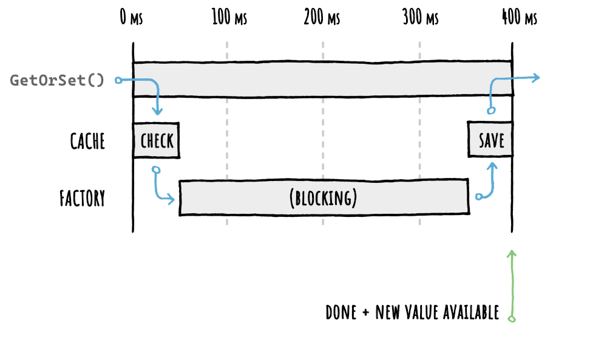
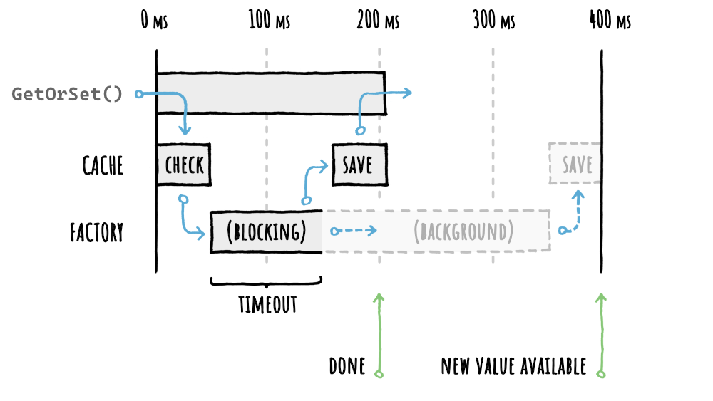

<div style="text-align:center;">


</div>

# :stopwatch: Timeouts

There are different types of timeouts available and it may be useful to know them.

:bulb: For a complete example of how to use them and what results you can achieve there's the [:trophy: Step By Step](StepByStep.md) guide.
## Factory Timeouts

Sometimes your data source (database, webservice, etc) is overloaded, the network is congested or something else bad is happening and the end result is things start to get **:snail: very slow** to get a fresh piece of data.

Wouldn't it be nice if there could be a way to simply let FusionCache temporarily reuse an expired cache entry if the factory is taking too long?

Enter **soft/hard timeouts**.

You can specify:

- **Soft Timeout**: to be used if there's an expired cache entry to use as a fallback

- **Hard Timeout**: to be used in any case, no matter what. In this last case an exception will be thrown and you will have to handle it yourself, but in some cases that would be more preferable than a very slow response

You can specify them both (the **soft** should be lower than the **hard**, of course) and the appropriate one will be used based on the presence of an expired entry to be eventually used as a fallback.

In both cases it is possible (and enabled *by default*, so you don't have to do anything) to let the timed-out factory keep running in the background and update the cached value as soon as it finishes, so you get the best of both worlds: a **fast response** and **fresh data** as soon as possible.

### :bulb: Example
As an example let's say we have a piece of code like this:

```csharp
product = cache.GetOrSet<Product>(
    "product:123",
    _ => GetProductFromDb(123),
    options => options
        .SetDuration(TimeSpan.FromMinutes(2))
);
```

In this **very hypothetical and made up scenario** (don't look too much into the numbers, they just serve as a reference point) we may have a timeline like this:



As you can see in this case the factory is taking around `300 ms`, and the entire method call is taking around `400 ms`, which is too much for us.

So we simply enable **fail-safe** and specify a **soft timeout** of `100 ms`:

```csharp
product = cache.GetOrSet<Product>(
    "product:123",
    _ => GetProductFromDb(123),
    options => options
        .SetDuration(TimeSpan.FromMinutes(2))
        // ENABLE FAIL-SAFE
        .SetFailSafe(true)
        // SET A 100 MS SOFT TIMEOUT
        .SetFactoryTimeouts(TimeSpan.FromMilliseconds(100))
);
```

The end result is this:



Now after `100 ms`, FusionCache will give us back the expired value, let's say in around `150 ms` total.

Also, it will complete the factory execution in the background and, as soon as it will complete, the cached value will be updated so that any new request will have the fresh value ready to be used.


## Distributed Cache Timeouts

When using a distributed cache it is also possible to observe some slowdowns in case of network congestions or something else.

In this case it may be useful to also set soft/hard timeouts for the distributed cache for the operations that must be waited (like getting a value from it), whereas the non critical ones (like saving a value into it) can simply run in the background, so a timeout is less important.
